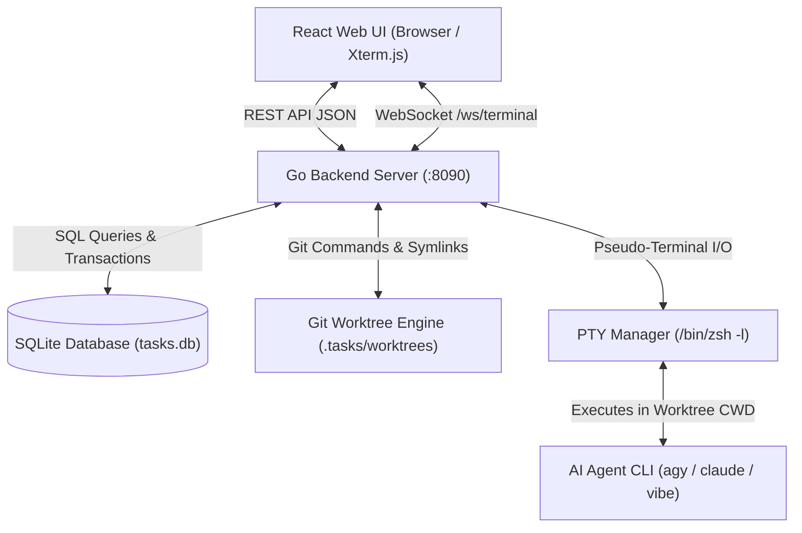
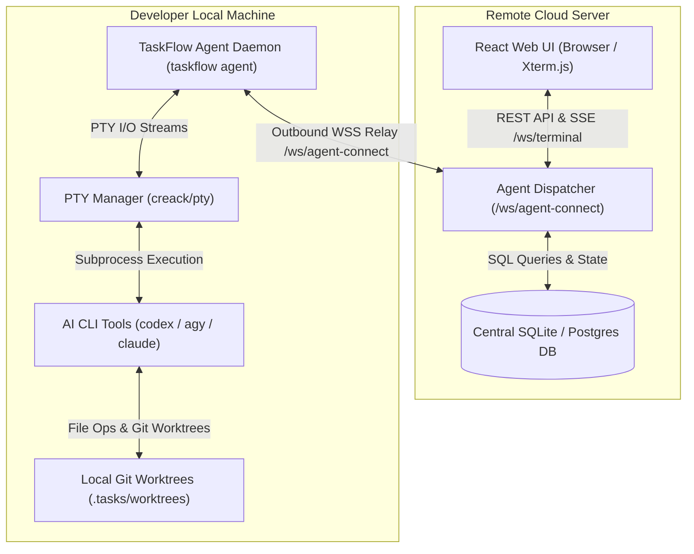

# Architecture & System Design

This document details the software architecture, design patterns, internal subsystems, and data flows of **TaskFlow**.

---

## 1. High-Level Architecture

TaskFlow is designed as a lightweight, single-binary capable full-stack application consisting of:
1. **Backend Go Server (`cmd/server`)**: High-performance HTTP REST API, background task queue worker, Git worktree manager, and WebSocket PTY pseudo-terminal server.
2. **Frontend React SPA (`web/`)**: Modern TypeScript Single Page Application featuring Kanban drag-and-drop, interactive list views, Git diff inspection, chat drawer, and embedded Xterm.js terminal emulator.
3. **Embedded SQLite Database (`tasks.db`)**: Zero-configuration, ACID-compliant local database storing projects, tasks, activities, comments, and settings.
4. **Git Worktree Isolation Engine**: Dedicates a clean, branch-isolated physical filesystem directory (`.tasks/worktrees/<taskKey>`) per task, ensuring concurrent task development without dirtying the main working tree.
5. **Agent CLI Orchestration Engine**: Integrates natively with AI coding agents via subprocess execution and interactive PTY sessions.



---

## 2. Backend Go Architecture

The backend is structured under Go standard packaging conventions:

```
cmd/server/main.go            # Entry point, router setup, static asset handler
internal/
├── db/
│   └── db.go                 # SQLite access layer, queue runner, worktree logic, schema
├── handlers/
│   ├── handlers.go           # HTTP REST endpoints & WebSocket terminal proxy
│   └── handlers_test.go      # Integration and unit tests
├── models/
│   └── models.go             # Data transfer objects and domain models
├── runner/
│   ├── runner.go             # Subprocess execution, dynamic PATH resolver, CLI finder
│   └── runner_test.go        # Subprocess runner unit tests
└── terminal/
    └── terminal.go           # Interactive PTY Manager (creack/pty + WebSockets)
```

### 2.1 Concurrency Model & Lock Discipline

The `db.DB` struct manages concurrent read and write operations against SQLite using a `sync.RWMutex`:
- **Read Operations**: Protected by `d.mu.RLock()`.
- **Write Operations**: Protected by `d.mu.Lock()`.
- **Internal Helper Rule (`Unsafe` methods)**:
  > [!IMPORTANT]
  > To prevent self-deadlocks (e.g. holding a write lock while calling a method that acquires a read lock), internal private helper methods that execute queries without acquiring locks are suffixed with `Unsafe` (such as `getProjectsUnsafe()`, `getSettingsUnsafe()`, `getProjectByIDUnsafe()`). Public API methods acquire the lock and call these unsafe helpers.

### 2.2 Dynamic Binary & Environment Resolution

TaskFlow does **not** hardcode user home directories or fixed binary paths. `internal/runner/runner.go` provides:
- `GetDynamicCustomPath()`: Dynamically discovers the user's home directory and compiles standard executable paths:
  `~/.local/bin`, `/opt/homebrew/bin`, `/usr/local/bin`, `/usr/bin`, `/bin`, `~/go/bin`, `~/.cargo/bin`.
- `FindCliTool(tool string)`: Dynamically searches `PATH` and fallback directories for `agy`, `claude`, `vibe`, `git`, etc.

---

## 3. Git Worktree Isolation & Skill Propagation

### 3.1 Worktree Lifecycle

When a task requires execution (via AI skill or Interactive Terminal), `EnsureTaskWorktree` is called:
1. Validates that the project `repo_path` is a valid Git repository.
2. Ensures that `.tasks/` is appended to `.gitignore` so temporary worktrees are never committed.
3. Computes the target Git branch name (e.g. `TASK-1-implement-some-feature`).
4. Checks if `.tasks/worktrees/<taskKey>` already exists:
   - If valid, checks out the target branch.
   - If corrupted or mismatched, removes and prunes the worktree.
5. Spawns `git worktree add <worktreePath> -b <branchName> <baseBranch>`.

### 3.2 Automatic Symlink & Skill Injection

To make the worktree fully functional immediately without re-downloading dependencies or losing project configurations, the engine automatically symlinks:
- `.env*` (execution environement).
- `.agents/`, `.taskflow/` (agent configurations, skills, and memory).
- Automatically writes default skill files (`clarify-issue`, `specify-issue`, `code-issue`, `adjust-issue`, `pick-issue`) `.agents/skills/` within the worktree.

---

## 4. Interactive PTY & WebSocket Subsystem

The terminal subsystem (`internal/terminal/terminal.go`) gives the browser a true interactive login shell:

1. **PTY Session Creation (`creack/pty`)**:
   - Spawns the user's login shell (`$SHELL` or `/bin/zsh -l`).
   - Sets the working directory (`Dir`) to the task's worktree.
   - Injects contextual environment variables:
     - `TASKFLOW_TASK_ID` (and legacy `TASKACAO_TASK_ID`): Unique task UUID.
     - `TASKFLOW_TASK_KEY` (and legacy `TASKACAO_TASK_KEY`): Task human key (e.g. `TASK-1`).
     - `TASKFLOW_TASK_BRANCH` (and legacy `TASKACAO_TASK_BRANCH`): Active task branch.
     - `TASKFLOW_TASK_WORKTREE` (and legacy `TASKACAO_TASK_WORKTREE`): Absolute worktree path.
2. **Circular Output Buffer**:
   - Maintains a 64KB circular replay buffer per session so that reconnecting browser tabs immediately see the latest terminal output.
3. **Bi-directional WebSocket Streaming (`/ws/terminal?taskId=...`)**:
   - **Incoming Client Frames**:
     - Raw keystrokes / ANSI sequences are written directly to the PTY master file descriptor.
     - JSON control messages (e.g. `{"type": "resize", "cols": 120, "rows": 35}`) invoke `pty.Setsize()`.
   - **Outgoing Server Frames**:
     - Streamed as binary or text frames directly to the Xterm.js frontend instance.

---

## 5. Background Queue Worker

TaskFlow includes an autonomous in-process background worker:
- Monitored via a Go channel `d.queueChan`.
- Fetches `queued` activities from SQLite in FIFO order.
- Executes the designated AI skill or script in the task worktree.
- Updates activity status (`running` → `completed` | `failed`) and captures stdout/stderr in the activity record.

---

## 6. Remote Web & Local Agent Decoupling

TaskFlow supports a decoupled architecture separating the central **Remote Web UX & Database** (Cloud Control Plane) from the developer's **Local Background Agent** (Edge Execution Worker):



### 6.1 Responsibilities Breakdown: Control Plane vs. Execution Plane

The architecture strictly decouples the centralized governance and visualization layer (**Control Plane**) from the developer's workstation runtime (**Data / Execution Plane**):

| Domain | Remote Server & WebUI (Control Plane) | Local Agent & Gateway (Execution Plane) |
| :--- | :--- | :--- |
| **Execution & Triggers** | • Presents tasks, board, backlog, and activity logs<br>• Triggers step execution via WebSocket dispatch (`dispatch_step`) | • Receives dispatch over outbound WebSocket<br>• Launches native desktop terminal (Ghostty, iTerm) or local PTY |
| **LLM & AI Tasks** | • Centralizes AI provider selection & command templates | • Executes AI CLI agents (`agy`, `claude`, `codex`, `vibe`)<br>• Manages interactive human-in-the-loop terminal sessions |
| **Git & Worktrees** | • Records remote repository URL & branch metadata | • Manages local Git worktrees (`.tasks/worktrees/#<key>`)<br>• Performs code modifications, compilations, linters, tests<br>• Pushes branches and creates pull requests (`gh pr create`) |
| **Scaffolding & Config** | • Stores global project settings, tracker tokens, and stage models | • Scaffolds local skill directories (`.agents/`, `.agy/`, `.skills/`)<br>• Supports local configuration overrides (custom terminal, skills) *(Roadmap)* |
| **Task Management & MCP** | • Exposes central API and **MCP Server** (`/mcp` / `/sse`)<br>• Serves project context, tracker sync, task state, comments | • Runs embedded local reverse proxy gateway (`127.0.0.1:8091`)<br>• Forwards skill transitions with automatic authentication<br>• Bridges local AI tools to TaskFlow via local stdio MCP (`taskflow mcp`) |

### 6.2 Architectural Principles
1. **Outbound WebSocket Relay**:
   - The local daemon connects outward to `wss://<remote-server>/ws/agent-connect` using an authentication token.
   - Outbound connections eliminate firewall ingress, port-forwarding, or public IP requirements on the developer's workstation.
2. **Session Guard & Identity Verification**:
   - Commands are dispatched to an agent only when `web_session.user_id == agent_session.user_id`.
   - Rebind policy: Enforces a 1:1 active connection limit per user/project mapping; new connections gracefully disconnect older daemons with code `4001 Session Rebound`.
3. **Local-First Execution Privacy**:
   - All LLM interactions, API keys, Git worktrees, code edits, and compiler/test runs remain strictly on the developer's machine.

### 6.3 Interactive Execution UX: Option 1 & Option 2

#### Option 1: Native External Terminal Launch (Current Implementation)
To provide a smooth developer experience without dumping interactive AI sessions into a background daemon's raw stdout:
- **Native Window Launch**: When a user triggers an interactive workflow skill (`/clarify-issue`, `/specify-issue`, `/code-issue`) from the central Web UI, the connected local agent daemon launches a native desktop terminal window (e.g. **Ghostty**, **iTerm2**, or **Terminal.app**) directly inside the task's worktree (`.tasks/worktrees/#<key>`).
- **Interactive AI Session**: Launches the configured CLI provider tool (`agy -i "/clarify-issue"`, `claude`, `codex`, or `vibe`), enabling interactive prompts, diff approvals, and conversation directly in the user's preferred terminal.
- **Hierarchy of Terminal Selection**:
  1. CLI flag `--terminal <app>` passed to `taskflow agent` (e.g., `ghostty`, `iterm`, `terminal`, `pty`).
  2. Workstation overrides in `.taskflow/agent.json`, then project/server settings (`externalTerminalCommand`).
  3. Legacy local project configuration (`.taskflow/config.json` in the worktree).
  4. Environment variable `TASKFLOW_TERMINAL`.
  5. Auto-detection on macOS (`/Applications/Ghostty.app` -> `ghostty`, then `iTerm.app` -> `iterm`, then `Terminal.app` -> `terminal`, with fallback to embedded `pty`).

#### Desktop console host (current architecture)
The Electron application in desktop/ hosts native coding terminals through the
local agent's authenticated loopback API. Its sandboxed renderer uses a narrow
IPC bridge; Electron holds the connection credential. The agent owns PTYs and
supervised processes independently of window lifetime. Users can select a task,
type into its terminal, stop execution, export logs and map local project paths.
The web has no embedded terminal, local branch switcher, diff viewer or worktree
controls. See ADR 0003 for boundaries and recovery limitations.

### 6.4 Local Agent HTTP Gateway & Skill Access
When workflow skills execute in local worktrees, they require access to TaskFlow task management (e.g. reporting stage transitions, updating ticket state):
1. **Embedded Agent Reverse Proxy**:
   - The `taskflow agent` daemon launches an embedded HTTP reverse proxy on `127.0.0.1:8091` (or dynamic loopback port).
   - Injects `TASKFLOW_AGENT_URL`, `TASKFLOW_SERVER_URL`, and `TASKFLOW_AGENT_TOKEN` into the environment of every terminal and PTY session.
   - Forwards local skill calls (`POST /api/tasks/stage`, `GET /api/tasks/...`) upstream to the remote server, transparently attaching Bearer token authentication.
2. **Explicit Endpoint Selection**:
   - `taskflow mcp` uses `$TASKFLOW_AGENT_URL`, then `$TASKFLOW_SERVER_URL`, then the local default.
   - Errors are returned to the caller. No retry against another database/server is performed after a failed mutation.

---

## 7. Model Context Protocol (MCP) Server Architecture

### 7.1 Motivation: Replacing Prompt-Injected Bash Curl Calls
Before MCP, TaskFlow instructed AI agents to update tickets using markdown prompt instructions with embedded `curl` commands. This pattern suffers from:
- **Syntax & Escaping Fragility**: LLMs frequently introduce formatting errors, mis-escape quotes or newlines in `<REPORT_NOTE>`, or omit critical headers.
- **One-Way Execution**: Agents cannot easily query ticket context (e.g. comments, parent epics, reviewer notes, sprint metadata) without manual file reading or guesswork.
- **Lack of Verification**: There is no direct feedback loop between the LLM and the server's validation rules prior to attempting a transition.

Integrating an **MCP (Model Context Protocol)** server elevates TaskFlow from a passive prompt-injected system to a first-class tool provider natively supported by modern AI agents (**Google Antigravity / agy**, **Claude Code**, **Cursor**, **Windsurf**, **VS Code**).

### 7.2 MCP Tools Specification
The TaskFlow MCP Server exposes the following core tools:

| Tool Name | Parameters | Description |
| :--- | :--- | :--- |
| `taskflow_get_task` | `taskKey`: string (e.g. `#47`) | Fetches structured task details: title, description, tracker, current stage, branch name, worktree path, and comments. |
| `taskflow_transition_stage` | `taskKey`: string, `stage`: enum (`clarified`, `specified`, `implemented`, `reviewed`, `finished`), `note`: string, `branch`?: string, `prUrl`?: string | Transitions the task stage atomically and records the activity report on the remote server and tracker. |
| `taskflow_add_comment` | `taskKey`: string, `body`: string | Posts a comment or clarification question directly onto the task discussion thread. |
| `taskflow_list_tasks` | `projectId`?: string, `status`?: string, `sprint`?: string | Lists active tasks on the board to support multi-ticket planning and batch skills (`pickup-issues`). |
| `taskflow_get_project_context` | `projectId`?: string, `taskKey`?: string | Retrieves project-wide architecture guidelines, spec framework choice (`openspec` / `speckit`), and coding conventions. |

### 7.3 Dual Deployment Topologies
```mermaid
graph TD
    subgraph Local Machine
        CLI["AI Agent CLI (agy / claude / cursor)"]
        StdioMCP["taskflow mcp (Local Stdio Server)"]
        LocalDaemon["taskflow agent (Local Daemon)"]
        Worktree["Git Worktree (.tasks/worktrees/#<key>)"]

        CLI <-->|JSON-RPC 2.0 (stdio)| StdioMCP
        CLI <-->|Read / Edit Code| Worktree
        StdioMCP <-->|IPC / Loopback Proxy| LocalDaemon
    end

    subgraph Remote Server
        RemoteServer["TaskFlow Central Server (:8090)"]
        RemoteMCP["Remote MCP Endpoint (/mcp or /sse)"]
        Database[("Central DB (SQLite / PostgreSQL)")]
        TrackerAPI["GitHub / Linear / Jira"]

        LocalDaemon <-->|Outbound WSS / HTTPS| RemoteServer
        RemoteServer <--> RemoteMCP
        RemoteServer <--> Database
        RemoteServer <--> TrackerAPI
    end
```

1. **Topology A: Remote Server-Side MCP (`/mcp` / `/sse`)**:
   - The central TaskFlow server provides an HTTP Server-Sent Events (SSE) or streamable HTTP MCP endpoint.
   - Useful for remote web agents, CI/CD runners, and cloud-hosted assistants with network reachability to the server.
2. **Topology B: Local Stdio MCP (`taskflow mcp`)**:
   - `taskflow mcp` operates over standard input/output (`stdio`), the universal protocol supported by `agy`, Claude Code, Cursor, and Windsurf.
   - When running against a remote control plane, `taskflow mcp` relays tool calls through the local agent daemon or loopback gateway, keeping all local execution private and firewall-free.

### 7.4 Skill Evolution: Transition from Bash Curl Snippets to Native MCP Tools
With the arrival of the TaskFlow MCP Server, the definition of skills (`SKILL.md`) undergoes a major evolutionary shift:

- **Legacy Model (Markdown Prompt with Bash Curl Snippet)**:
  - The skill instructions contained raw markdown describing a bash `curl` command with placeholders (`<KEY>`, `<REPORT_NOTE>`, `<ACTUAL_BRANCH>`).
  - Fragile: LLMs frequently failed on JSON quote escaping, omitted parameters, or failed to invoke curl altogether.
- **Target MCP Model (Declarative Prompt with Typed MCP Tools)**:
  - Instead of running a bash subprocess, the skill instructs the LLM:
    > "When this stage is completed and verified, invoke the `taskflow_transition_stage` tool with your structured summary note and assigned branch."
  - For stage inspection: The LLM directly calls `taskflow_get_task(taskKey)` to read live comments, acceptance criteria, and tracker context.
  - For interactive queries: The LLM calls `taskflow_add_comment(taskKey, question)` to post clarification questions to the ticket thread.
  - Type-safe, validated by JSON Schema, and completely free of shell-escaping bugs.

### 7.5 Purely API-Based Configuration Contract
The boundary between the Remote Web UX / Central Server and the Local Agent is strictly contract-driven:

1. **Remote Central Server as Single Source of Truth**:
   - Holds team configurations, tracker secrets (GitHub/Linear/Jira tokens), project definitions, workflow stages, and AI command templates.
   - Exposes a versioned REST/WebSocket API contract for agent synchronization.
2. **Local Agent as Stateless Consumer & Local Executor**:
   - Never accesses the remote SQLite/Postgres database directly.
   - Upon connection (`/ws/agent-connect`), receives or queries the project configuration contract.
   - Uses the configuration contract to:
     - Scaffold local skill directories (`.agents/`, `.skills/`).
     - Resolve target worktree paths and branch naming conventions.
     - Launch the configured desktop terminal (Ghostty/iTerm) and AI CLI (`agy`/`claude`).
   - Supports local overrides layered on top of the remote contract (e.g. locally preferred terminal emulator, offline custom prompts) without polluting central state.


### 7.6 Implemented configuration contract

`GET /api/v1/agent/config?projectId=<id>` or `?taskKey=<key>` returns
`schemaVersion: 1`, project and tracker identity, description, specification
framework, workflow stages/mappings, resolved AI and terminal settings, and skill
content (including project overrides). Server repository paths and tracker secrets
are excluded. Repository conventions such as AGENTS.md remain local; MCP returns
the central project description and skill instructions and directs agents to read
those local conventions.

Concrete project agents synchronize on connection. Every dispatch refreshes the
actual task project's configuration; wildcard registration IDs are not used as
project IDs in the dispatch payload. A failed fetch or unknown schema version
prevents launching. `.taskflow/agent.json` provides local repository mappings and
AI, terminal and skill overrides. Scaffolded files use a hash manifest so subsequent
refreshes back up manual edits before installing the current managed content. Git worktrees are created and validated on the
workstation, independently of the central database.

The implementation uses Streamable HTTP at `/mcp`; legacy `/sse` is not exposed.
The stdio process discovers and forwards the remote tool schemas using the official
MCP Go SDK. Both machine endpoints share bearer validation with the agent
handshake, optionally pinned by `TASKFLOW_SERVER_TOKEN`. This remains a single-user
credential policy, not multi-tenant identity management. Tracker updates retain
the existing asynchronous queue semantics and tool results identify queued sync.

### 7.7 Automatic client bootstrap and terminal confirmation

Before starting the targeted LLM CLI, the local agent merges a `taskflow` stdio
server entry into its project-scoped MCP configuration. The command is the absolute
path of the running TaskFlow executable with `mcp --url <gateway>` arguments.
The gateway holds authentication; generated client files contain no TaskFlow token.
Updates preserve unrelated settings and MCP entries, reject malformed files, and
use atomic replacement. Provider trust prompts are not bypassed.

Supported configuration formats follow the official documentation for
[Codex](https://developers.openai.com/codex/mcp/),
[Antigravity](https://www.antigravity.google/docs/mcp),
[Gemini](https://geminicli.com/docs/tools/mcp-server/), and
[Vibe](https://docs.mistral.ai/vibe/code/cli/mcp-servers), plus Claude and Cursor's
project MCP JSON formats. Codex and Vibe use native TOML parsing; the other clients
use JSON. Bootstrap runs before agent-owned PTY launches.

External terminal dispatch carries `action: open_terminal` and `ttyMode: external`,
independently of an optional skill ID. The initiating HTTP request waits up to 45
seconds for a result from the same agent connection and dispatch ID. A failure is
returned to the browser. A timeout reports an unconfirmed launch and does not
resend the command. OS launcher processes are reaped, and immediate failures
include stderr. Shell script display strings, paths and environment values are
quoted as literal data; displaying a command cannot execute it a second time.

### Native coding clients and the local launcher

TaskFlow uses its web UI for task management and Codex/Claude's native interface
for coding conversations and approvals. The experimental Electron chat client
has been removed. The launcher prepares repositories/worktrees and registers MCP;
it does not maintain a separate conversation or approval protocol.

```text
Web TaskFlow -> outbound-connected local agent -> native terminal / coding CLI
Native coding CLI -> local MCP bridge -> agent gateway -> TaskFlow task services
```

An explicit project connection also bootstraps the selected repository so a user
can invoke pickup directly in a native client. Both entry points share skills and
MCP tools. See ADR 0002 for the scope of the native-client architecture.

### Optional desktop companion

The server, local agent and desktop app are independent components. Start the
agent without the app:

```sh
export TASKFLOW_AGENT_TOKEN='your-server-token'
taskflow agent --url http://localhost:8090 --repo /path/to/repository
```

The agent owns PTYs, supervision and console history. The desktop discovers it
through `~/.taskflow/agent-connection.json` (private, mode 0600), including when
opened after executions begin. Closing the app leaves executions running.
The desktop can also start the same agent when none is running.
`--desktop` is a deprecated no-op; `--terminal` is accepted for compatibility
but executions always use agent-owned consoles. `--desktop-info` can override
the discovery file for isolated instances; the app automatically discovers the
default file and its legacy private connection file.

## Workstation project disconnection

The desktop can disconnect a project locally without deleting its server identity
or repository. The local agent persists the decision, excludes disconnected
projects from repository resolution and execution admission, and serializes
removal with queue registration. Removal requires confirmed process exit for
the project's executions. The renderer uses authoritative agent state to hide
the project and its retained console history until explicit re-add. See
[the local API contract](contracts/server-agent-v1.md#local-project-disconnection)
and [desktop instructions](../desktop/README.md#remove-a-local-project).
