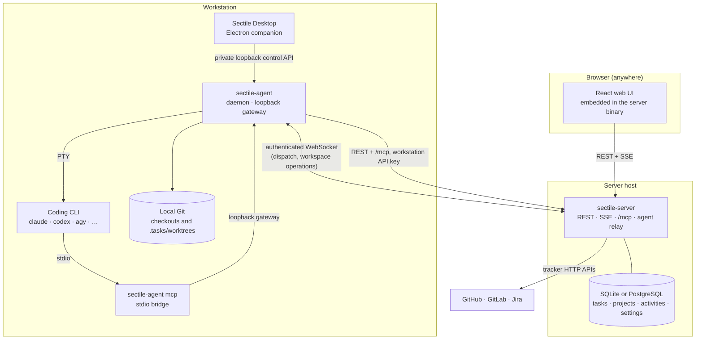
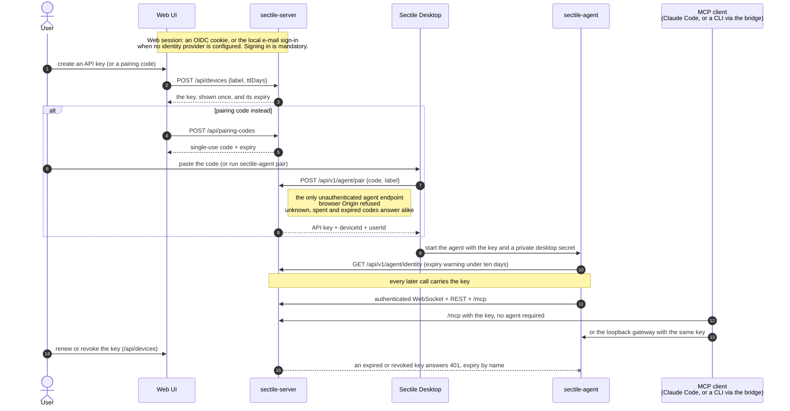

# Architecture and system design

Sectile separates a headless control plane from workstation execution. The two
Go executables are independently buildable; Electron is an optional companion.

## Deployment topology

Three boundaries decide what may talk to what: the browser, the server host and
the workstation. The server never reaches into a workstation, and the agent is
the only process on the workstation that holds an upstream credential.



Electron packages only the agent executable, so a workstation runs the companion
and the daemon and nothing else; the server host runs the server and its database.
Closing the companion leaves the agent and its executions running.

An interactive, revision-pinned version of this topology (per-component source
links, guided views, light/dark themes, PNG/SVG export) is checked in at
[`diagrams/sectile-architecture.html`](diagrams/sectile-architecture.html). Its
[specification](diagrams/sectile-architecture.json) is the editable source; regenerate
the page from the repository root with the [Archify](https://github.com/tt-a1i/archify)
skill, after refreshing `meta.repository.revision` to the commit the source links
should point at:

```bash
node <archify-checkout>/bin/archify.mjs deliver architecture docs/diagrams/sectile-architecture.json docs/diagrams/sectile-architecture.html --quality showcase --repo-root .
```

## Communication flow of a launch

One skill launch crosses every boundary above. The board moves because the coding
CLI reports through MCP, not because the launch was acknowledged: an
acknowledgement does not advance a stage.

```mermaid
sequenceDiagram
    autonumber
    participant UI as Web UI
    participant S as sectile-server
    participant A as sectile-agent
    participant C as Coding CLI
    participant M as MCP bridge
    participant F as GitHub / GitLab / Jira

    UI->>S: launch a skill on a task (mode: interactive or autonomous)
    S->>S: record the launch activity
    S-->>A: dispatch over the authenticated WebSocket
    A->>A: reuse the assigned checkout, else create a task worktree
    A->>A: build the command line for the mode<br/>(the autonomous command, else the interactive one)
    A->>C: spawn in a PTY
    C->>M: start_run
    M->>S: /mcp, workstation API key<br/>(directly; the agent gateway also accepts it)
    S->>S: persist the run
    C->>M: get_task · add_comment · transition_stage
    M->>S: /mcp
    S->>F: queued tracker write (labels, status, comment)
    C->>M: finish_run
    M->>A: loopback gateway
    A->>S: /mcp
    S-->>UI: server-sent event, the board reflects the new stage
```

A launch acknowledgement is not a transition. For PR-bearing stages the forge
must confirm the branch, URL and pushed commit before the stage moves; review also
requires a ready PR and a clean checkout reported by the agent.

## API keys and authentication

One API key per workstation is the credential every machine surface takes: the
agent, the desktop app, `/mcp` on the server and the agent gateway. The user
creates it from the profile, where it is shown once, or earns it by spending a
pairing code, which is worth nothing on its own and short lived. The desktop app
takes the pairing code only: it never asks for a key to paste, and reuses the one
an earlier pairing stored when it restarts its agent. Keys expire
after 90 days by default, can be renewed without changing the secret, and are
revocable one workstation at a time ([ADR 0011](adrs/0011-one-api-key-for-agent-and-mcp.md)).



Loopback alone authorizes nothing: every local process can reach the gateway
port, so the API key is required before the agent proxies a call, and the
comparison is constant time. The server resolves a key to the user it was
issued to, so actions are attributed per user while the task board stays shared.
The endpoint contract behind this flow is in
[MCP and authentication](#mcp-and-authentication),
[ADR 0007](adrs/0007-user-identity-and-agent-binding.md) for the identity
binding and [ADR 0011](adrs/0011-one-api-key-for-agent-and-mcp.md) for the key.

## Ownership and packages

| Component | Responsibility |
| --- | --- |
| `cmd/server` | HTTP routes, embedded web assets and database startup; no command dispatch or browser launch |
| `internal/db` | Persisted tasks, projects, board/roadmap/sprint configuration, workflow and tracker queues |
| `internal/handlers` | Server API, upstream MCP and authenticated agent relay |
| `internal/trackerapi` | GitHub REST/GraphQL with explicit server credentials |
| `cmd/agent` | Dispatch only: picks the daemon, the MCP bridge or the command supervisor and wires nothing else |
| `internal/agent` | Workstation daemon, loopback/control APIs, launch queue and execution supervision |
| `internal/agentmcp` | Stdio MCP bridge a coding CLI spawns; never opens SQLite |
| `internal/agentexec` | Terminal-side supervisor of one agent-owned command, and process-group control |
| `internal/agenthttp` | Agent-side HTTP client that carries the workstation API key on its transport |
| `internal/agentprotocol` | Shared message envelope and workspace operation DTOs |
| `internal/agentconfig` | Secret-free configuration contract and agent-owned installation helpers |
| `internal/workspace`, `internal/runner`, `internal/terminal` | Local Git, tool execution and PTYs |
| `desktop` | Electron UI for existing agent consoles; packages only the agent executable |

Agent production imports exclude DB, server handlers, SQLite and embedded web
assets. The server may read its own environment/configuration and database files;
it never reads a workstation checkout, CLI credential store or skill receipt file.
Pure normalization helpers live in `models`; the server dependency graph excludes
the subprocess runner, workspace and terminal packages.

## Server persistence and queues

The store holds projects, tasks, activities, settings and tracker operation
state. It is SQLite by default, and PostgreSQL when `DB_DRIVER=postgres` names
it. The two share one `*db.DB`, one schema and one set of queries: a small
unexported `dialect` inside `internal/db` carries the six things that differ
(connection, placeholder rebinding, DDL type names, catalogue introspection, the
encryption key directory, and whether the historical migrations apply). See
[ADR 0016](adrs/0016-postgresql-as-an-alternative-store.md) for why the seam is
below `*db.DB` rather than an interface above it.
The established database lookup order remains unchanged. `DB` uses an RWMutex;
helpers suffixed `Unsafe` assume the caller already holds the appropriate lock.
Avoid calling public locking methods while holding that lock.

That mutex stops at the process boundary, so no invariant depends on it: several
server processes may share one PostgreSQL database. A read-decide-write either
runs as one statement, as a conditional update, or in a transaction that locks
its row with `SELECT ... FOR UPDATE` (a no-op on SQLite, whose single writer
already serialises). One ordinary active run per task is a partial unique index,
and one server-side job per project a PostgreSQL advisory lock. Every section the
mutex protects, and what makes it hold across processes, is listed in
[the concurrency audit](db-concurrency-audit.md).

Tracker jobs run on the server even when no agent is connected. GitHub repository
identity is explicit configuration. Native HTTP clients
paginate lists and follow redirects within the same origin while preserving the
request method. Redirect chains are bounded; redirects and pagination to another
origin are rejected. Missing
credentials, non-success HTTP responses and GraphQL errors propagate to the
activity instead of marking an unconfirmed write successful. A Jira refusal
carries the site's own error messages, which is what names a mandatory field the
instance adds to a creation.

Background skill jobs dispatch to the matching agent. Their launch activity is
separate from the remote execution record and its MCP workflow results. A launch
acknowledgement does not advance a stage. For PR-bearing stages, forge data must
confirm the assigned branch, URL and pushed commit; review additionally requires
a ready PR and a clean checkout reported by the agent. Human merge remains outside
this workflow. There is no server-local result-file worker or LLM process.

## Workstation mapping and worktrees

The agent downloads fresh project configuration for each operation. Configuration
contains identity, effective skills and defaults, without server filesystem paths
or tracker credentials. Local repositories are mapped by project primary key in
`~/.config/sectile/settings.json`, with repository overrides supported under
`.taskflow/agent.json`. Git remote identity can match the current repository.
Repositories are never cloned implicitly. On a multi-repo project, each
repository the project declares is mapped by its remote identity instead
(`repositories`), and a task runs in a worktree of the repository it is pinned
to; a launch that cannot tell which waits for the pin (ADR 0028).

Task preparation reuses the assigned branch's existing checkout where possible.
Otherwise it creates `.tasks/worktrees/<taskKey>` locally. Existing mismatched
worktrees fail visibly; preparation does not reset a branch to accommodate a
request. Shared checkouts execute serially. Worktree projects admit up to five
parallel executions according to the workstation setting, which defaults to one. Tasks using the same checkout cannot execute concurrently.

Only the agent writes repository skills and `.taskflow/config.json` or updates
the marked section of `AGENTS.md`. It preserves unrelated configuration keys and
personal instructions. Modified managed skills are backed up before replacement;
retired modified skills remain personal. Root-bound file access rejects escaping
symlinks. The downloaded `.taskflow/remote-config.json` is diagnostic, never an
offline configuration fallback.

## Local operations and consoles

The server sends named workspace capabilities over the authenticated agent
connection. Requests and responses carry a unique `msgId`; responses from another
connection are ignored. Agent absence, disconnect, timeout and reported errors
fail visibly. No local server fallback or automatic mutation retry occurs.
The agent validates task/project identity and resolves directories from its local
mapping and Git metadata. The shared operation type accepts named capabilities and explicit editor/provider
settings; it does not accept arbitrary working directories.

The agent owns PTYs, queue admission, process supervision and in-memory history.
Electron discovers it through the private `~/.taskflow/agent-connection.json` file.
Closing Electron leaves the agent and its executions running. Launch, stop and
restart controls use authenticated loopback APIs and confirmed process outcomes.
The old server `/ws/terminal` and session endpoints return HTTP 410; consoles are
available through the companion's agent connection.

Workstation project disconnection persists independently of the server catalog.
It removes local mapping/overrides without deleting a checkout or remote project.
Active executions and busy configuration return conflicts. Re-adding the project
restores eligibility for local execution.

## MCP and authentication

The server's Streamable HTTP `/mcp` service exposes eleven typed tools:
`list_projects`, `get_task`, `list_tasks`, `get_project_context`, `create_task`,
`update_task`, `add_comment`, `transition_stage`, `start_run`, `finish_run` and
`prepare_macro_worktree`. The MCP server identity is
`sectile`. Native clients use `sectile-agent mcp --url <loopback-address>` as a
stdio bridge. It never opens SQLite and uses the agent's upstream credential.

The agent refreshes native provider MCP registration before launch. Generated
entries address the server, never a local gateway: a Streamable HTTP entry with
the workstation API key as bearer for the CLIs that support it, the stdio bridge
with the key in its environment for the others, written owner-only. Existing
unrelated provider settings are preserved; malformed settings prevent launch
rather than being overwritten. Native client trust prompts remain native.

Server machine endpoints validate the workstation API key. The agent reads it
from `--token`, `TOKEN` or the settings file written by `sectile-agent pair`, and
local callers reach its gateway with that same key. The server resolves a key to
the user it was issued to, so actions are attributed per user while the task
board stays shared. Loopback control APIs have their own private desktop token
and reject cross-origin access. Keys are created from the web profile, shown
once, and can be earned by spending a single-use, short-lived pairing code; see
[ADR 0007](adrs/0007-user-identity-and-agent-binding.md) for the identity
binding and [ADR 0011](adrs/0011-one-api-key-for-agent-and-mcp.md) for the key.
`SECTILE_SERVER_TOKEN` is deprecated for one release and is the only credential
outside the key store that a machine surface accepts; see
[ADR 0019](adrs/0019-the-machine-surfaces-have-no-open-mode.md) for the removal
of the legacy open mode. Deploy the browser REST interface behind the
appropriate access-control boundary.

See [the complete interface contract](contracts/server-agent-v1.md),
[the runtime ADR](adrs/0006-independent-server-agent-runtimes.md) and
[build/deployment instructions](../README.md#quick-start).
