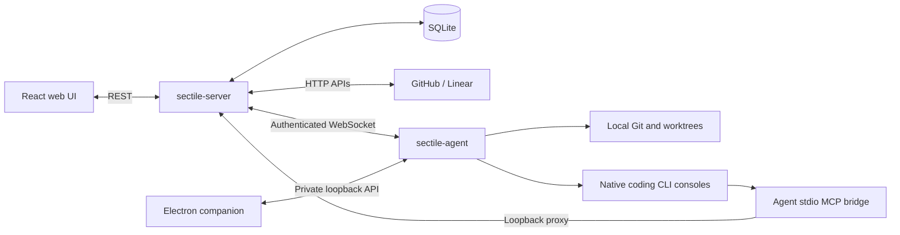

# Architecture and system design

Sectile separates a headless control plane from workstation execution. The two
Go executables are independently buildable; Electron is an optional companion.



An interactive, revision-pinned version of the same topology — with per-component
source links, guided views, light/dark themes and PNG/SVG export — is checked in at
[`diagrams/sectile-architecture.html`](diagrams/sectile-architecture.html). Its
[specification](diagrams/sectile-architecture.json) is the editable source; regenerate
the page from the repository root with the [Archify](https://github.com/tt-a1i/archify)
skill, after refreshing `meta.repository.revision` to the commit the source links
should point at:

```bash
node <archify-checkout>/bin/archify.mjs deliver architecture docs/diagrams/sectile-architecture.json docs/diagrams/sectile-architecture.html --quality showcase --repo-root .
```

## Ownership and packages

| Component | Responsibility |
| --- | --- |
| `cmd/server` | HTTP routes, embedded web assets and SQLite startup; no command dispatch or browser launch |
| `internal/db` | Persisted tasks, projects, board/roadmap/sprint configuration, workflow and tracker queues |
| `internal/handlers` | Server API, upstream MCP and authenticated agent relay |
| `internal/trackerapi` | GitHub REST/GraphQL and Linear GraphQL with explicit server credentials |
| `cmd/agent` | Workstation daemon, loopback/control APIs, MCP bridge, launch queue and execution supervision |
| `internal/agentprotocol` | Shared message envelope and workspace operation DTOs |
| `internal/agentconfig` | Secret-free configuration contract and agent-owned installation helpers |
| `internal/workspace`, `internal/runner`, `internal/terminal` | Local Git, tool execution and PTYs |
| `desktop` | Electron UI for existing agent consoles; packages only the agent executable |

Agent production imports exclude DB, server handlers, SQLite and embedded web
assets. The server may read its own environment/configuration and database files;
it never reads a workstation checkout, CLI credential store or skill receipt file.
Pure normalization helpers live in `models`; the server dependency graph excludes
the subprocess runner, workspace and terminal packages.

## Server persistence and queues

SQLite stores projects, tasks, activities, settings and tracker operation state.
The established database lookup order remains unchanged. `DB` uses an RWMutex;
helpers suffixed `Unsafe` assume the caller already holds the appropriate lock.
Avoid calling public locking methods while holding that lock.

Tracker jobs run on the server even when no agent is connected. GitHub repository
identity and Linear team identity are explicit configuration. Native HTTP clients
paginate lists and follow redirects within the same origin while preserving the
request method. Redirect chains are bounded; redirects and pagination to another
origin are rejected. Missing
credentials, non-success HTTP responses and GraphQL errors propagate to the
activity instead of marking an unconfirmed write successful. Jira metadata remains
readable; Jira synchronization is unsupported in this baseline.

Background skill jobs dispatch to the matching agent. Their launch activity is
separate from the remote execution record and its MCP workflow results. A launch
acknowledgement does not advance a stage. For PR-bearing stages, forge data must
confirm the assigned branch, URL and pushed commit; review additionally requires
a ready PR and a clean checkout reported by the agent. Human merge remains outside
this workflow. There is no server-local result-file worker or LLM process.
Digest generation also delegates LLM execution to an agent.

## Workstation mapping and worktrees

The agent downloads fresh project configuration for each operation. Configuration
contains identity, effective skills and defaults, without server filesystem paths
or tracker credentials. Local repositories are mapped by project primary key in
`~/.config/taskflow/settings.json`, with repository overrides supported under
`.taskflow/agent.json`. Git remote identity can match the current repository.
Repositories are never cloned implicitly.

Task preparation reuses the assigned branch's existing checkout where possible.
Otherwise it creates `.tasks/worktrees/<taskKey>` locally. Existing mismatched
worktrees fail visibly; preparation does not reset a branch to accommodate a
request. Shared checkouts execute serially. Worktree projects admit up to three
parallel executions according to effective server defaults and workstation
preferences. Tasks using the same checkout cannot execute concurrently.

Only the agent writes repository skills and `.taskflow/config.json` or updates
the marked section of `AGENTS.md`. It preserves unrelated configuration keys and
personal instructions. Modified managed skills are backed up before replacement;
retired modified skills remain personal. Root-bound file access rejects escaping
symlinks. The downloaded `.taskflow/remote-config.json` is diagnostic, never an
offline configuration fallback.

## Local operations and consoles

The server sends named workspace capabilities over the authenticated agent
connection. Requests and responses carry a unique `msgId`; responses from another
connection are ignored. Agent absence, disconnect, timeout and reported errors
fail visibly. No local server fallback or automatic mutation retry occurs.
The agent validates task/project identity and resolves directories from its local
mapping and Git metadata. The shared operation type accepts named capabilities and explicit editor/provider
settings; it does not accept arbitrary working directories.

The agent owns PTYs, queue admission, process supervision and in-memory history.
Electron discovers it through the private `~/.taskflow/agent-connection.json` file.
Closing Electron leaves the agent and its executions running. Launch, stop and
restart controls use authenticated loopback APIs and confirmed process outcomes.
The old server `/ws/terminal` and session endpoints return HTTP 410; consoles are
available through the companion's agent connection.

Workstation project disconnection persists independently of the server catalog.
It removes local mapping/overrides without deleting a checkout or remote project.
Active executions and busy configuration return conflicts. Re-adding the project
restores eligibility for local execution.

## MCP and authentication

The server's Streamable HTTP `/mcp` service exposes nine typed tools:
`list_projects`, `get_task`, `list_tasks`, `get_project_context`, `create_task`,
`add_comment`, `transition_stage`, `start_run` and `finish_run`. The MCP server identity is
`sectile`. Native clients use `sectile-agent mcp --url <loopback-address>` as a
stdio bridge. It never opens SQLite and uses the agent's upstream credential.

The agent refreshes native provider MCP registration before launch. Generated
entries contain the executable and active gateway address, without bearer tokens.
Existing unrelated provider settings are preserved; malformed settings prevent
launch rather than being overwritten. Native client trust prompts remain native.

Server machine endpoints validate `SECTILE_SERVER_TOKEN` when configured. The
agent reads its device credential from `--token` or `TOKEN` and keeps it in
process: local callers reach its gateway with a per-session loopback secret,
which the gateway exchanges for that credential upstream. The server resolves a
device credential to the user it was paired with, so actions are attributed per
user while the task board stays shared. Loopback control APIs have their own
private token and reject cross-origin access. Workstations are paired
through a single-use, short-lived code issued by the web interface; see
[ADR 0007](adrs/0007-user-identity-and-agent-binding.md). Deploy the browser
REST interface behind the appropriate access-control boundary.

See [the complete interface contract](contracts/server-agent-v1.md),
[the runtime ADR](adrs/0006-independent-server-agent-runtimes.md) and
[build/deployment instructions](../README.md#quick-start).
