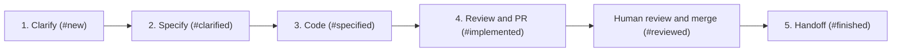

# Core Capabilities & Workflows

This document outlines the functional capabilities, workflow engines, and AI orchestration pipelines provided by **Sectile** (formerly Sectile).

## Task access from agent sessions

Skills first use the local Sectile agent's exposed task-management interface, discovered from the session or project context. The policy does not imply that every deployed agent exposes such an interface. When it is missing or fails after a bounded attempt, the server at `http://localhost:8090` is a temporary fallback. Record the observed failure, look for an existing project bug, and register or update it when authorized; otherwise preserve the bug report locally.

Resolve the project by repository and verify the full task ID and external URL before a mutation. List tasks with the explicit project ID and send `taskId`, rather than a potentially ambiguous key such as `#47`, to the stage endpoint. Task creation also requires the explicit project ID.

A managed run's supplied result contract takes precedence over standalone transitions. The agent validates local evidence and the server owns tracker synchronization. An active run with no usable completion contract must be reported; do not clear its activity or use another endpoint to bypass validation. A successful terminal launch is not proof that a workflow step completed.

These instructions are maintained in `internal/db/skilltemplates.go` and mirrored in the repository's skill and command files. Project-specific skill overrides remain authoritative and must receive the same correction through the supported project skill editor before redistribution. The known local-agent integration gap is tracked in [issue #50](https://github.com/sebastienferry/sectile/issues/50).

---

## 1. Multi-Project Workspace Management

Sectile supports multiple concurrent software repositories and projects from a single unified dashboard:

- **Isolated Project Configurations**:
  - `repo_path`: Local filesystem path to the project repository.
  - `git_remote_url`: Remote Git repository URL.
  - `issue_tracker`: Tracker provider (`linear`, `github`, `jira`, or `local`).
  - `stage_mapping`: Custom mapping between Sectile workflow stages and external tracker states.
  - `skill_overrides`: Project-specific prompt template overrides.

- **Dynamic Workspace Switcher**:
  - The UI allows filtering tasks by project (`All Projects` vs individual projects).
  - When creating or editing tasks, the task is strictly bound to its parent project, automatically inheriting tracker properties and working directories.

---

## 2. Issue Tracker Abstraction Layer

The server owns native GitHub REST/GraphQL and Linear GraphQL adapters. It
synchronizes, creates and updates issues and comments using explicit server
credentials, even with all local agents offline. GitHub also supports milestone
operations and issue transfer. Local tasks stay in SQLite. Jira metadata remains
readable, but Jira synchronization is unsupported in this baseline.

Projects specify `githubRepo` (`owner/repository`) or `linearTeam` (team key).
Workstation CLI credentials and local repository paths are never used by the
server. Remote writes remain queued and their actual HTTP/API failures appear
in Activities. See [server credential configuration](../README.md#server-tracker-credentials).

## 3. Autonomous AI Skill Pipeline

Sectile orchestrates tasks through a five-stage progressive development lifecycle:

### Stage 1: Clarification (`clarify-issue` / `/clarify`)
- **Objective**: Identifies functional gaps, edge cases, and architectural ambiguities.
- **Output**: Records settled scope and reversible technical assumptions. Only essential product decisions or unavailable dependencies block an unattended run; the presence of a PTY does not itself require interactive questions.

### Workflow completion

Local skills execute on the agent. Background jobs dispatch the same native skill
contract and track launch acknowledgement separately from remote completion.
Skills call MCP `start_run`, submit verified stages through `transition_stage`,
and call `finish_run` when the invocation ends. A process exit or launch
acknowledgement alone never advances the ticket. The former server-side result-file
worker is retired; the server does not open an agent checkout or receipt file.

PR-bearing transitions require matching forge evidence from the server HTTP
adapter and checkout branch/commit evidence from the connected agent. Review
requires a ready PR and a clean checkout. Missing credentials, disconnected agents,
unpushed commits and replacement PRs prevent completion. Human merge remains
separate. Pickup skills retain ownership of their ordered stage checklist and
must run the project's checks before submitting a transition.

### Stage 2: Technical Specification (`specify-issue` / `/specify`)
- **Objective**: Generates an actionable, implementation-ready technical specification, following the Spec-Driven Design framework configured on the project.
- **Output**: Stores markdown specification with system diagrams, API contracts, modified files list, and test requirements.
- **Framework**: `speckit` writes `specs/<KEY>-<slug>/{spec,plan,tasks}.md` under a GitHub Spec Kit project; `openspec` writes a change proposal under `openspec/changes/<KEY>-<slug>/`. See section 2b.

---

## 2b. Spec-Driven Design Toolchains (Spec Kit / OpenSpec)

Sectile does not merely reference an SDD framework — it installs it. Two are
supported, selectable per project and as a global default:

| | GitHub Spec Kit | OpenSpec |
|---|---|---|
| CLI | `specify` | `openspec` |
| Installed via | `uv` / `uvx` from `git+https://github.com/github/spec-kit.git` | `npm` / `npx` from `@fission-ai/openspec` |
| Initializer | `specify init --here --ai <agent>` | `openspec init` |
| Scaffolds | `.specify/` (constitution, templates) and `specs/` | `openspec/` (`project.md`, `changes/`, `specs/`) |
| Artefact shape | spec.md → plan.md → tasks.md | proposal.md + design.md + tasks.md + spec deltas (`ADDED` / `MODIFIED` / `REMOVED`) |

Endpoints:

- `GET /api/spec-framework/status?projectId=…&framework=…` — reports, per
  framework, whether the CLI is reachable in `PATH` (`cliAvailable`,
  `cliCommand`) and whether the working directory is already initialized
  (`initialized`, `markerPaths`). Omitting `framework` reports on both.
- `POST /api/spec-framework/install` — body `{framework, repoPath, projectId,
  aiAgent, force}`. Installs the CLI when missing, then runs the initializer.

The installer tries the richest invocation first and falls back to progressively
narrower ones, because flag support varies across CLI versions. Every attempted
command is returned in `steps[]` with its shell string, success flag, and output,
so a failure can be diagnosed and replayed by hand. `force: true` re-runs the
initializer over an already-initialized directory. Each install is also recorded
as an activity (`skillId: install_spec_framework`).

Prerequisites are the user's responsibility and are reported rather than
installed silently: Spec Kit needs `uv` (`curl -LsSf https://astral.sh/uv/install.sh | sh`),
OpenSpec needs Node.js. The CLI status panel surfaces `uv`, `specify` and
`openspec` alongside `git`, `gh`, `linear` and `acli`.

Note: OpenSpec is a Spec-Driven Design workflow, unrelated to **OpenFeature**
(a feature-flag standard). Earlier builds stored `openfeature` as a spec
framework value; the database migrates that value to `openspec` on startup.

### Stage 3: Implementation (`code-issue` / `/code`)
- **Objective**: Implements the required code changes directly inside the task's isolated Git worktree.
- **Output**: Edits codebase, verifies build, prepares clean atomic commits, and creates or reuses a draft PR when implementation owns PR creation. The specification-time policy creates the draft earlier.

### Stage 4: Adjust (`adjust-issue`)
- **Objective**: Reviews and repairs the diff, updates affected documentation, runs final checks, then pushes and updates the same existing branch PR and verifies readiness. Available review feedback is addressed; absence of comments does not block review.
- **Output**: Verified Pull Request URL attached to the task card and external issue tracker. The autonomous chain stops here for human review and merge.

### Stage 5: Handoff (`handoff-issue`)
- **Objective**: Confirms the merge and writes the handover and acceptance checklist.
- **Output**: Finished ticket and safe cleanup of clean, unused local worktrees. Shared batch worktrees remain until every associated ticket is handed off.

---

## 4. Agent-owned consoles

The agent hosts native coding CLI sessions in local PTYs. The optional desktop
connects through the private loopback API and displays console replay, input and
execution status. While connected, its header server address opens the board in
the default browser using mouse or keyboard activation. Closing the desktop
leaves active executions running. Legacy server terminal endpoints return 410
and do not create a shell.

## 5. Live Git Diff & Branch Management

- **Side-by-Side & Inline Git Diff Inspector**: Displays real-time file diffs between the active task branch and `main` using syntax highlighting.
- **Branch Checkout & Worktree Switcher**: Allows the developer to switch their main editor CWD or inspect the worktree directory in one click.
- **Auto-Pruning**: Safely removes worktrees when tasks are marked as finished or deleted.
