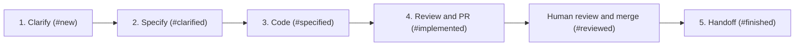

# Core Capabilities & Workflows

This document outlines the functional capabilities, workflow engines, and AI orchestration pipelines provided by **Sectile** (formerly Sectile).

## Task access from agent sessions

Skills first use the local Sectile agent's exposed task-management interface, discovered from the session or project context. The policy does not imply that every deployed agent exposes such an interface. When it is missing or fails after a bounded attempt, the server at `http://localhost:8090` is a temporary fallback. Record the observed failure, look for an existing project bug, and register or update it when authorized; otherwise preserve the bug report locally.

Resolve the project by repository and verify the full task ID and external URL before a mutation. List tasks with the explicit project ID and send `taskId`, rather than a potentially ambiguous key such as `#47`, to the stage endpoint. Task creation also requires the explicit project ID.

A managed run's supplied result contract takes precedence over standalone transitions. The agent validates local evidence and the server owns tracker synchronization. An active run with no usable completion contract must be reported; do not clear its activity or use another endpoint to bypass validation. A successful terminal launch is not proof that a workflow step completed.

These instructions are maintained in `internal/db/skilltemplates.go` and mirrored in the repository's skill and command files. Project-specific skill overrides remain authoritative and must receive the same correction through the supported project skill editor before redistribution. The known local-agent integration gap is tracked in [issue #50](https://github.com/sebastienferry/sectile/issues/50).

---

## 1. Multi-Project Workspace Management

Sectile supports multiple concurrent software repositories and projects from a single unified dashboard:

- **Isolated Project Configurations**:
  - `repo_path`: Local filesystem path to the project repository.
  - `git_remote_url`: Remote Git repository URL.
  - `issue_tracker`: Tracker provider (`github`, `jira`, or `local`).
  - `tracker_columns` / `stage_columns`: Board columns, the tracker statuses they group, and the workflow stage each column carries. This is what maps a Sectile stage onto an external tracker state.
  - `skill_overrides`: Project-specific prompt template overrides.

- **Dynamic Workspace Switcher**:
  - The UI allows filtering tasks by project (`All Projects` vs individual projects).
  - When creating or editing tasks, the task is strictly bound to its parent project, automatically inheriting tracker properties and working directories.

---

## 2. Issue Tracker Abstraction Layer

The server owns native GitHub REST/GraphQL adapters. It
synchronizes, creates and updates issues and comments using explicit server
credentials, even with all local agents offline. GitHub also supports milestone
operations and issue transfer. Local tasks stay in SQLite. Jira metadata remains
readable, but Jira synchronization is unsupported in this baseline.

Projects specify `githubRepo` (`owner/repository`).
Workstation CLI credentials and local repository paths are never used by the
server. Remote writes remain queued and their actual HTTP/API failures appear
in Activities. See [server credential configuration](../README.md#server-tracker-credentials).

## 3. Autonomous AI Skill Pipeline

Sectile orchestrates tasks through a five-stage progressive development lifecycle:



### Stage 1: Clarification (`clarify-issue` / `/clarify`)
- **Objective**: Identifies functional gaps, edge cases, and architectural ambiguities.
- **Output**: Records settled scope and reversible technical assumptions. Only essential product decisions or unavailable dependencies block an unattended run; the presence of a PTY does not itself require interactive questions.

### Workflow completion

Local skills execute on the agent. Background jobs dispatch the same native skill
contract and track launch acknowledgement separately from remote completion.
Skills call MCP `start_run`, submit verified stages through `transition_stage`,
and call `finish_run` when the invocation ends. A process exit or launch
acknowledgement alone never advances the ticket. The former server-side result-file
worker is retired; the server does not open an agent checkout or receipt file.

PR-bearing transitions require matching forge evidence from the server HTTP
adapter and checkout branch/commit evidence from the connected agent. Review
requires a ready PR and a clean checkout. Missing credentials, disconnected agents,
unpushed commits and replacement PRs prevent completion. Human merge remains
separate. Pickup skills retain ownership of their ordered stage checklist and
must run the project's checks before submitting a transition.

### Stage 2: Technical Specification (`specify-issue` / `/specify`)
- **Objective**: Generates an actionable, implementation-ready technical specification, following the Spec-Driven Design framework configured on the project.
- **Output**: Stores markdown specification with system diagrams, API contracts, modified files list, and test requirements.
- **Framework**: `speckit` writes `specs/<KEY>-<slug>/{spec,plan,tasks}.md` under a GitHub Spec Kit project; `openspec` writes a change proposal under `openspec/changes/<KEY>-<slug>/`. See section 2b.

---

## 2b. Spec-Driven Design Toolchains (Spec Kit / OpenSpec)

Sectile does not merely reference an SDD framework — it installs it. Two are
supported, selectable per project and as a global default:

| | GitHub Spec Kit | OpenSpec |
|---|---|---|
| CLI | `specify` | `openspec` |
| Installed via | `uv` / `uvx` from `git+https://github.com/github/spec-kit.git` | `npm` / `npx` from `@fission-ai/openspec` |
| Initializer | `specify init --here --ai <agent>` | `openspec init` |
| Scaffolds | `.specify/` (constitution, templates) and `specs/` | `openspec/` (`project.md`, `changes/`, `specs/`) |
| Artefact shape | spec.md → plan.md → tasks.md | proposal.md + design.md + tasks.md + spec deltas (`ADDED` / `MODIFIED` / `REMOVED`) |

Endpoints:

- `GET /api/spec-framework/status?projectId=…&framework=…` — reports, per
  framework, whether the CLI is reachable in `PATH` (`cliAvailable`,
  `cliCommand`) and whether the working directory is already initialized
  (`initialized`, `markerPaths`). Omitting `framework` reports on both.
- `POST /api/spec-framework/install` — body `{framework, repoPath, projectId,
  aiAgent, force}`. Installs the CLI when missing, then runs the initializer.

The installer tries the richest invocation first and falls back to progressively
narrower ones, because flag support varies across CLI versions. Every attempted
command is returned in `steps[]` with its shell string, success flag, and output,
so a failure can be diagnosed and replayed by hand. `force: true` re-runs the
initializer over an already-initialized directory. Each install is also recorded
as an activity (`skillId: install_spec_framework`).

Prerequisites are the user's responsibility and are reported rather than
installed silently: Spec Kit needs `uv` (`curl -LsSf https://astral.sh/uv/install.sh | sh`),
OpenSpec needs Node.js. The CLI status panel surfaces `uv`, `specify` and
`openspec` alongside `git`, `gh` and `acli`.

Note: OpenSpec is a Spec-Driven Design workflow, unrelated to **OpenFeature**
(a feature-flag standard). Earlier builds stored `openfeature` as a spec
framework value; the database migrates that value to `openspec` on startup.

### Stage 3: Implementation (`code-issue` / `/code`)
- **Objective**: Implements the required code changes directly inside the task's isolated Git worktree.
- **Output**: Edits codebase, verifies build, prepares clean atomic commits, and creates or reuses a draft PR when implementation owns PR creation. The specification-time policy creates the draft earlier.

### Stage 4: Adjust (`adjust-issue`)
- **Objective**: Reviews and repairs the diff, updates affected documentation, runs final checks, then pushes and updates the same existing branch PR and verifies readiness. Available review feedback is addressed; absence of comments does not block review.
- **Output**: Verified Pull Request URL attached to the task card and external issue tracker. The full chain run stops here by default for human review and merge.

### Stage 5: Handoff (`handoff-issue`)
- **Objective**: Confirms the merge and writes the handover and acceptance checklist.
- **Output**: Finished ticket and safe cleanup of clean, unused local worktrees. Shared batch worktrees remain until every associated ticket is handed off.
- **Where it is offered**: the web task card and detail modal, and the desktop app when an execution is stopped on a task already at `reviewed` — the desktop then proposes closing the task rather than leaving it at that stage.

---

## 3bis. Execution modes

A skill run is executed in one of two modes.

| Mode | What the run does | Who moves the stage |
| --- | --- | --- |
| **interactive** | Opens a terminal window with the provider CLI and the task prompt. The user answers it. | The user, by confirming the session is over. |
| **autonomous** | Runs the CLI headless: no terminal window, no foreground process group, and the provider's non-interactive approval mode so nothing waits for a permission answer nobody can give. Output is captured and recorded on the run activity, bounded and marked when truncated. | The run itself, through `transition_stage`. The server checks, when the run closes, that the stage moved, and records on the run when it did not. It never posts the transition on the run's behalf: an exit status is not evidence that the work was done. |

### How the mode of one launch is decided

The first level with an opinion wins:

1. The **one-off override** chosen for that launch.
2. The **skill's own setting**, edited in the skill editor. Its third value,
   *project default*, is what lets a skill have no opinion.
3. The **project default** (`defaultSkillMode` in the project settings).
4. **Interactive**, which is what the tool did before the setting existed.

The mode is resolved on the server and travels to the agent with the launch.
The agent applies what it is told and never re-decides from its own
configuration copy, so a stale agent cannot open a window inside a run nobody
is watching.

### Where the one-off override is offered

| Surface | Control |
| --- | --- |
| Web task card `...` menu | *Advance interactively* / *Advance autonomously*, next to the plain *Advance*, in both board display modes |
| Web task detail modal | A **Mode** selector next to the additional-instructions field |
| Desktop **Launch** dialog | An **Execution mode** selector per task |
| Desktop **Relaunch** dialog | An **Execution mode** selector |
| Desktop next-step button | None: one click, on the resolved mode |

A control left on its default sends no override at all, so the precedence
applies unchanged. The card menu offers the override whether the board is
condensed or expanded: the expanded card's inline chevrons launch on the
resolved mode and carry no override, so the menu is the only place the choice
is made in either shape.

### Providers supporting an autonomous run

| Provider | Headless invocation |
| --- | --- |
| `claude` | `claude -p --permission-mode bypassPermissions` |
| `codex` | `codex exec` (approval bypass not attested here yet) |
| `vibe` | `vibe -p --auto-approve` |
| `agy`, `gemini`, `cursor` | None attested: an autonomous launch is refused by name |

A headless run carries the provider's non-interactive approval mode because
there is no terminal and no stdin: without it the CLI is denied every tool it
asks for, the Sectile MCP tools included, and ends having only printed why it
could not work. The interactive form carries no bypass — that is where a human
answers. A discussion and a bare terminal are always interactive, whatever the
project default says: they open a live session with no prompt of their own, so
headless they would be a CLI with no input at all.

Each mode has its own configured command, at both the global and the project
level: `aiCommandTemplate` for interactive launches and
`aiCommandTemplateAutonomous` for headless ones. A command written for headless
use answers for itself and needs no marker, because its author wrote it for that
mode. The two are inherited independently, so a project may spell out one and
keep the other from the global settings. Both empty means the provider's own
attested command lines, for example:

```bash
# interactive
claude --model <model> '<prompt>'
# autonomous
claude -p --permission-mode bypassPermissions --model <model> '<prompt>'
```

An autonomous launch is **refused**, never silently downgraded to interactive. A
configuration with no headless command falls back to `aiCommandTemplate`, which
then owns its own mode: it is refused unless it carries a
`{mode:AUTONOMOUS|INTERACTIVE}` marker, for example `agy {mode:-p|-i} '{prompt}'`.

### The full chain run

The `>>` action, **Full chain**, always runs autonomous, whatever mode those
skills would resolve to on their own. It forces the mode rather than letting the
precedence decide, since a chain nobody is watching must not open a terminal.

Two entry points exist and they do not do the same thing:

- The web card's `>>` launches the `pickup` skill, which walks the workflow
  itself. The stop stage reaches it through `get_project_context`.
- `POST /api/tasks/{id}/advance` with `{"auto": true}` goes through the server's
  own chain entry, which reads `fullChainStopStage` directly and refuses to start
  on a task already at or past that stage, or on a provider with no attested
  headless invocation, before enqueuing anything. Each step it enqueues carries
  the stop stage on its run; when that run closes having advanced the stage, the
  step that follows is enqueued, until the stop stage is reached. The chain stops
  — and says so on the run that ended — when the step failed, when it completed
  without moving the task, or when no step follows the stage reached.

`fullChainStopStage` is either `implemented` (before the pull request) or
`reviewed` (the default, after it). Merging is never automated.

---

## 4. Agent-owned consoles

The agent hosts native coding CLI sessions in local PTYs. The optional desktop
connects through the private loopback API and displays console replay, input and
execution status. While connected, its header server address opens the board in
the default browser using mouse or keyboard activation. Closing the desktop
leaves active executions running. Legacy server terminal endpoints return 410
and do not create a shell.

## 4bis. Knowing which session is waiting for you

Several agent sessions run in parallel across worktrees and desktop tabs, and a
session blocked on a permission prompt looks exactly like one still working.

**The hooks report, they do not alert.** Setting up the Claude provider installs
two scripts under `~/.claude/hooks` and registers them in
`~/.claude/settings.json`: `sectile-notification.sh` on the `Notification` event,
`sectile-stop.sh` on `Stop`. They are POSIX shell, need no `jq`, exit 0 on every
path and write nothing on standard output — a hook must never interrupt the
session it reports on.

What they report depends on what the session carries:

| Session | Report | Effect |
|---|---|---|
| Launched by Sectile (`SECTILE_RUN_ID` present) | `POST <loopback>/control/runs/{id}/waiting` | the run is marked waiting, everywhere |
| Any other Claude Code session | `POST <loopback>/desktop/session-alert`, authenticated with `~/.taskflow/agent-connection.json` | a banner, and nothing else |
| A workstation that was never paired | none | silent no-op |

**The desktop raises the banner.** The notification comes from the desktop
application, through Electron's notification API — a thin binding over
`UNUserNotificationCenter` on macOS, toast notifications on Windows and the
freedesktop specification on Linux. The banner is therefore a real system
notification, attributed to Sectile and carrying an icon, on the three platforms
and with no external binary. The desktop already polls `/desktop/runs` every two
seconds; it is the *transition* that notifies — not waiting to waiting, or
running to a terminal status — so a repeated poll raises nothing.

A workstation that denies notifications is checked once and then left alone: the
state is still in the list, which is what answers the question.

**One icon vocabulary.** `shared/runStates.ts` is the single definition of what
each run state looks like: its label, its colour and its glyph. The web badge
renders it as an inline SVG; the desktop renders the same definition into the
notification's icon. The glyph on the banner is therefore the glyph on the task
row, by construction rather than by convention.

**The state itself.** A waiting report stamps `waitingSince` on the run. The run
keeps the status `running`: waiting is a phase of a run, not a status of its
own. Any terminal status clears the stamp, so a session killed while blocked
cannot leave a run waiting forever. The board indicator shows waiting ahead of
running, with how long the wait has lasted, and the activities view has a
matching filter.

## 5. Live Git Diff & Branch Management

- **Side-by-Side & Inline Git Diff Inspector**: Displays real-time file diffs between the active task branch and `main` using syntax highlighting.
- **Branch Checkout & Worktree Switcher**: Allows the developer to switch their main editor CWD or inspect the worktree directory in one click.
- **Auto-Pruning**: Safely removes worktrees when tasks are marked as finished or deleted.
