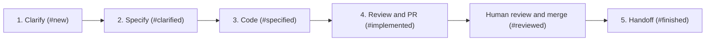

# Core Capabilities & Workflows

This document outlines the functional capabilities, workflow engines, and AI orchestration pipelines provided by **TaskFlow**.

---

## 1. Multi-Project Workspace Management

TaskFlow supports multiple concurrent software repositories and projects from a single unified dashboard:

- **Isolated Project Configurations**:
  - `repo_path`: Local filesystem path to the project repository.
  - `git_remote_url`: Remote Git repository URL.
  - `issue_tracker`: Tracker provider (`linear`, `github`, `jira`, or `local`).
  - `stage_mapping`: Custom mapping between TaskFlow workflow stages and external tracker states.
  - `skill_overrides`: Project-specific prompt template overrides.

- **Dynamic Workspace Switcher**:
  - The UI allows filtering tasks by project (`All Projects` vs individual projects).
  - When creating or editing tasks, the task is strictly bound to its parent project, automatically inheriting tracker properties and working directories.

---

## 2. Issue Tracker Abstraction Layer

TaskFlow provides a unified domain model over four issue sources

- Local (SQLite) : native SQLite storage for full offline support.
- Linear : through the `linear` CLI (https://github.com/schpet/linear-cli)
- Jira : through the Atlassian CLI `acli`
- GitHub : through `gh`

Each project carries its own tracker configuration: `linearTeam` for Linear,
`githubRepo` for GitHub, and `jiraProject` (the Jira project key passed to
`acli --project`) plus `trackerUrl` (the Jira base URL used to build
`/browse/<KEY>` links) for Jira.

Stage and status synchronisation is bidirectional: moving a card in
TaskFlow translates into `linear issue update --state`, `gh issue
close/reopen` or `acli jira workitem transition --state`. Comments from
skill runs are posted back to the remote issue.

| Operation | Linear | GitHub | Jira |
|---|---|---|---|
| Import | `linear issue list` | `gh issue list` | `acli jira workitem list --project <KEY>` |
| Create | `linear issue create` | `gh issue create` | `acli jira workitem create --project <KEY>` |
| Edit fields | `linear issue update` | `gh issue edit` | `acli jira workitem edit` |
| Transition | `linear issue update --state` | `gh issue close` / `reopen` | `acli jira workitem transition --state` |
| Comment | `linear issue comment` | `gh issue comment` | `acli jira workitem comment` |

Remote writes are queued as background jobs and surface in the Activities view,
so a failing CLI call is reported rather than silently dropped.

---

## 3. Autonomous AI Skill Pipeline

TaskFlow orchestrates tasks through a five-stage progressive development lifecycle:

### Stage 1: Clarification (`clarify-issue` / `/clarify`)
- **Objective**: Identifies functional gaps, edge cases, and architectural ambiguities.
- **Output**: Records settled scope and reversible technical assumptions. Only essential product decisions or unavailable dependencies block an unattended run; the presence of a PTY does not itself require interactive questions.

### Completion contract for managed runs

Each background workflow step receives a unique temporary result-file path and
run ID in its invocation, including when an agent is already open in a PTY.
The agent writes JSON with `runId`, `outcome` (`completed`, `blocked`, or
`retryable`), `summary`, `branch`, `prUrl`, `artifacts`, and `checks`.
Missing, stale, malformed or non-completed results fail the activity and stop the
chain without advancing the ticket. The report remains in the activity output;
the temporary file is removed after processing. A retry uses a fresh result file
and receives the previous local workflow report so it can resume existing work.

Before advancing, TaskFlow checks specification files exist and are nonempty
(`spec.md`, `tasks.md`, and `plan.md` or `design.md`), the actual work branch, and
reported build/lint/test evidence. Each check carries its command, exit code and
output, or a specific reason why it does not apply. Check execution remains the
agent's responsibility: TaskFlow validates the receipt rather than rerunning its
commands. Handoff additionally requires a successful merge-check receipt.

Review completion requires a clean checkout and a forge-confirmed open PR whose
source branch and commit match the checkout. A missing remote, unavailable CLI
or unconfirmed PR stops progress; TaskFlow never substitutes a local merge.
Worktree setup failures stop execution rather than falling back to the main
checkout. Worktrees remain available for review feedback and are only cleaned
up during confirmed handoff.

The worker owns transitions during managed runs; standalone stage and post-back
state updates are rejected while that workflow step is running. Standalone skill
invocations instead call the local TaskFlow stage handler after completing each step. Single and
batch pickup templates embed the same maintained stage instructions. Batch
invocations retain one branch and one combined PR, recording each ticket's
progress individually. Rewrite-story and macro refinement have no ticket-stage
transition contract.

Existing project-specific skill overrides and installed files are preserved.
Use the project's skill editor to compare or reset an override and reinstall
the generated defaults when adopting the revised templates. The managed result
contract is injected at runtime even with an older installed skill.

### Stage 2: Technical Specification (`specify-issue` / `/specify`)
- **Objective**: Generates an actionable, implementation-ready technical specification, following the Spec-Driven Design framework configured on the project.
- **Output**: Stores markdown specification with system diagrams, API contracts, modified files list, and test requirements.
- **Framework**: `speckit` writes `specs/<KEY>-<slug>/{spec,plan,tasks}.md` under a GitHub Spec Kit project; `openspec` writes a change proposal under `openspec/changes/<KEY>-<slug>/`. See section 2b.

---

## 2b. Spec-Driven Design Toolchains (Spec Kit / OpenSpec)

TaskFlow does not merely reference an SDD framework — it installs it. Two are
supported, selectable per project and as a global default:

| | GitHub Spec Kit | OpenSpec |
|---|---|---|
| CLI | `specify` | `openspec` |
| Installed via | `uv` / `uvx` from `git+https://github.com/github/spec-kit.git` | `npm` / `npx` from `@fission-ai/openspec` |
| Initializer | `specify init --here --ai <agent>` | `openspec init` |
| Scaffolds | `.specify/` (constitution, templates) and `specs/` | `openspec/` (`project.md`, `changes/`, `specs/`) |
| Artefact shape | spec.md → plan.md → tasks.md | proposal.md + design.md + tasks.md + spec deltas (`ADDED` / `MODIFIED` / `REMOVED`) |

Endpoints:

- `GET /api/spec-framework/status?projectId=…&framework=…` — reports, per
  framework, whether the CLI is reachable in `PATH` (`cliAvailable`,
  `cliCommand`) and whether the working directory is already initialized
  (`initialized`, `markerPaths`). Omitting `framework` reports on both.
- `POST /api/spec-framework/install` — body `{framework, repoPath, projectId,
  aiAgent, force}`. Installs the CLI when missing, then runs the initializer.

The installer tries the richest invocation first and falls back to progressively
narrower ones, because flag support varies across CLI versions. Every attempted
command is returned in `steps[]` with its shell string, success flag, and output,
so a failure can be diagnosed and replayed by hand. `force: true` re-runs the
initializer over an already-initialized directory. Each install is also recorded
as an activity (`skillId: install_spec_framework`).

Prerequisites are the user's responsibility and are reported rather than
installed silently: Spec Kit needs `uv` (`curl -LsSf https://astral.sh/uv/install.sh | sh`),
OpenSpec needs Node.js. The CLI status panel surfaces `uv`, `specify` and
`openspec` alongside `git`, `gh`, `linear` and `acli`.

Note: OpenSpec is a Spec-Driven Design workflow, unrelated to **OpenFeature**
(a feature-flag standard). Earlier builds stored `openfeature` as a spec
framework value; the database migrates that value to `openspec` on startup.

### Stage 3: Implementation (`code-issue` / `/code`)
- **Objective**: Implements the required code changes directly inside the task's isolated Git worktree.
- **Output**: Edits codebase, verifies build, prepares clean atomic commits.

### Stage 4: Review and Pull Request (`create-pr`)
- **Objective**: Reviews and repairs the diff, updates affected documentation, runs final checks, then pushes and creates or updates the branch's PR.
- **Output**: Verified Pull Request URL attached to the task card and external issue tracker. The autonomous chain stops here for human review and merge.

### Stage 5: Handoff (`handoff-issue`)
- **Objective**: Confirms the merge and writes the handover and acceptance checklist.
- **Output**: Finished ticket and safe cleanup of clean, unused local worktrees. Shared batch worktrees remain until every associated ticket is handed off.

---

## 4. Interactive ZSH Pseudo-Terminal (PTY Live)

For hands-on pair programming and manual debugging:
- Spawns an interactive login shell (`/bin/zsh -l`) in the task's dedicated worktree directory.
- Features Xterm.js emulation with full ANSI colors, cursor control, and keyboard navigation.
- Injects task context variables (`$TASKFLOW_TASK_KEY`, `$TASKFLOW_TASK_WORKTREE`).
- Action toolbar provides one-click triggers:
  - **`⚡ Run agent`**: Starts interactive conversation with the chosen agent.
  - **Skill actions** (`clarify-issue`, `specify-issue`, `code-issue`, `create-pr`): Send the skill name and ticket context to the running agent. Codex receives the plain name; other providers retain a leading `/`. Button labels and tooltips follow that syntax and any project skill-name overrides. Start the agent before selecting a skill; calls are rejected when no agent is running.
  - The project's agent setting takes precedence over the global setting. Codex is supported by the interactive launcher. Workflow steps reusing an open agent use the same invocation syntax; headless prompts are unchanged.
  - **`Ctrl+C`**: Sends interrupt signal to running processes.
  - **`Reset`**: Gracefully terminates and respawns a fresh shell.

---

## 5. Live Git Diff & Branch Management

- **Side-by-Side & Inline Git Diff Inspector**: Displays real-time file diffs between the active task branch and `main` using syntax highlighting.
- **Branch Checkout & Worktree Switcher**: Allows the developer to switch their main editor CWD or inspect the worktree directory in one click.
- **Auto-Pruning**: Safely removes worktrees when tasks are marked as finished or deleted.
