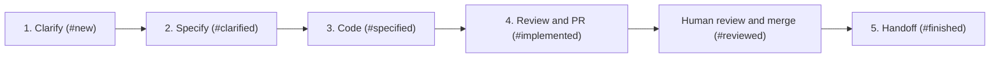

# Core Capabilities & Workflows

This document outlines the functional capabilities, workflow engines, and AI orchestration pipelines provided by **Sectile** (formerly Sectile).

## Task access from agent sessions

Skills first use the local Sectile agent's exposed task-management interface, discovered from the session or project context. The policy does not imply that every deployed agent exposes such an interface. When it is missing or fails after a bounded attempt, the server at `http://localhost:8090` is a temporary fallback. Record the observed failure, look for an existing project bug, and register or update it when authorized; otherwise preserve the bug report locally.

Resolve the project by repository and verify the full task ID and external URL before a mutation. List tasks with the explicit project ID and send `taskId`, rather than a potentially ambiguous key such as `#47`, to the stage endpoint. Task creation also requires the explicit project ID.

A managed run's supplied result contract takes precedence over standalone transitions. The agent validates local evidence and the server owns tracker synchronization. An active run with no usable completion contract must be reported; do not clear its activity or use another endpoint to bypass validation. A successful terminal launch is not proof that a workflow step completed.

These instructions are maintained in `internal/skills/catalog.go` and mirrored in the repository's skill and command files. Project-specific skill overrides remain authoritative and must receive the same correction through the supported project skill editor before redistribution. The known local-agent integration gap is tracked in [issue #50](https://github.com/sebastienferry/sectile/issues/50).

---

## 1. Multi-Project Workspace Management

Sectile supports multiple concurrent software repositories and projects from a single unified dashboard:

- **Isolated Project Configurations**:
  - `repo_path`: Local filesystem path to the project repository.
  - `git_remote_url`: Remote Git repository URL.
  - `issue_tracker`: Tracker provider (`github`, `jira`, or `local`).
  - `tracker_columns` / `stage_columns`: Board columns, the tracker statuses they group, and the workflow stage each column carries. This is what maps a Sectile stage onto an external tracker state.
  - `skill_overrides`: Project-specific prompt template overrides.

- **Dynamic Workspace Switcher**:
  - The UI allows filtering tasks by project (`All Projects` vs individual projects).
  - When creating or editing tasks, the task is strictly bound to its parent project, automatically inheriting tracker properties and working directories.

---

## 1bis. Users, roles and owned executions

A server shared by several people signs them in, gives each a role, and records
who started what.

- **Sign-in.** Through an OpenID Connect provider when one is configured, and
  otherwise through the local sign-in, an e-mail address and nothing else, which
  identifies people without authenticating them and is meant to be replaced by a
  provider. Signing in is mandatory: a deployment with no account shows the
  sign-in screen and no board, and the first person to sign in becomes the admin.
- **Personal and deployment settings.** Presentation, displayed identity and the
  workstation commands are personal to each account; auto-sync, the AI
  configuration, the repository path and the prompts are the deployment's and an
  admin's to change. The tracker keys sit on the deployment's row too, but a
  member may write them: configuring a project's tracker is part of opening it.
- **Two roles.** An admin owns the roster: who exists, what role they hold, and
  whether their account still opens. A member does everything else, including the
  board, its projects, its tasks, its transitions, its comments and executions on
  their own agent. When the provider supplies a role claim, that claim is the
  authority at every sign-in.
- **An account can be blocked or deleted, by an admin.** Blocking closes the door
  and keeps everything else: the open sessions are revoked at once, the
  workstation keys stop working, the next sign-in is refused, and unblocking
  gives all three back. Deleting removes the account and its credentials for
  good; the tasks, comments and executions it owns stay on the board with no
  owner. The last admin can be neither demoted, blocked nor deleted, and nobody
  closes their own account.
- **The board stays shared.** Everyone sees every project, task and running
  execution. The user-to-project binding is the agent registration that routes a
  run to the right machine, not a visibility rule.
- **Executions are owned.** A run records who started it, and only that person
  or an admin can stop it. The stop is dispatched to the owner's agent, so a run
  is closed as orphaned only when the agent that should hold it says it does
  not. A member's dispatch reaches their own agent whatever the request names.

See [ADR 0013](adrs/0013-roles-owned-executions-and-local-sign-in.md) and
[ADR 0018](adrs/0018-the-admin-owns-the-roster-not-the-board.md).

## 2. Issue Tracker Abstraction Layer

The server owns native GitHub REST/GraphQL and Jira Cloud REST adapters. It
synchronizes, creates and updates issues and comments using explicit
credentials, even with all local agents offline. A credential may belong to the
person who asked for the operation rather than to the server, and it travels
with the work all the way through the background queue: on a tracker that
attributes a write to the account behind the token, that is what puts the right
name on it. Jira accepts nothing else. GitHub also supports milestone
operations and issue transfer. Jira additionally exposes what a board is made of
— boards, columns, sprints, statuses, issue types, epics and teams — through the
read side of the ticketing abstraction, and writes sprint, team and epic. Local
tasks stay in SQLite.

GitHub also answers which pull requests belong to an issue, through its closing
references. A full synchronisation uses it to **rediscover pull requests** a
local store never recorded, which is what lets a project recreated on a second
instance come back with its links instead of empty ones. The read is a declared
capability, so a tracker that cannot answer is skipped silently; discovery is
additive, never removes or reorders a recorded link, is limited to tasks with no
link at or beyond the project's pull request creation stage, and its failures
are warnings on the synchronisation activity rather than synchronisation
failures. Detaching every link from a task suppresses automatic rediscovery for
it; a synchronisation triggered on that single task rediscovers anyway. See
[ADR 0017](adrs/0017-pull-requests-are-rediscovered-on-sync.md).

Projects specify `githubRepo` (`owner/repository`) or `jiraProject` (the Jira
project key) with `trackerUrl` (the site).
Workstation CLI credentials and local repository paths are never used by the
server. Remote writes remain queued and their actual HTTP/API failures appear
in Activities. See [server credential configuration](../README.md#server-tracker-credentials).

## 3. Autonomous AI Skill Pipeline

Sectile orchestrates tasks through a five-stage progressive development lifecycle:



### Stage 1: Clarification (`clarify-issue` / `/clarify`)
- **Objective**: Resolves functional gaps, edge cases, and architectural ambiguities through an iterative feedback loop between the agent and the work item owner (analogous to how `adjust-issue` iterates on code reviews).
- **Rounds & Reports**: Clarification executes in numbered rounds (Round 1, Round N). Findings are stored in `docs/clarifications/<n>.md` on the assigned work branch (`feat/<n>`), with dated sections `## Round N - answers from the owner (<date>)` appended as feedback arrives. Each round commits incrementally with `docs(spec): clarify #<n> (round <r>)`.
- **Exit Condition & Transition Guard**: Clarification ends only when the owner explicitly confirms that the clarification is satisfactory (or zero open product questions remain in unattended pickup). A task must **never** be transitioned `new → clarified` while any product question or decision remains open.
- **Interactive vs. Unattended Execution**:
  - *Interactive*: In a session with the owner present, the agent asks blocking questions directly and records answers in the next round.
  - *Unattended*: The agent records ambiguities, posts essential product questions to the ticket via `add_comment`, and terminates the run without transitioning.
  - *Autonomous Pickup* (`pickup-issue` / `pickup-issues`): Advances to specification only when zero product questions remain open; halts and posts blockers if any product question requires human decision.
- **Activity Lifecycle**: Each round is an independent Sectile run (`start_run` / `finish_run`), and thread history is preserved via `add_comment` and `get_task`.
- **Reference Case**: See ticket #180 (rounds 1 and 2 in `docs/clarifications/180.md`).

### Workflow completion

Local skills execute on the agent. Background jobs dispatch the same native skill
contract and track launch acknowledgement separately from remote completion.
Skills call MCP `start_run`, submit verified stages through `transition_stage`,
and call `finish_run` when the invocation ends. A process exit or launch
acknowledgement alone never advances the ticket. The former server-side result-file
worker is retired; the server does not open an agent checkout or receipt file.

PR-bearing transitions require matching forge evidence from the server HTTP
adapter and checkout branch/commit evidence from the connected agent. Review
requires a ready PR and a clean checkout. Missing credentials, disconnected agents,
unpushed commits and replacement PRs prevent completion. Human merge remains
separate. Pickup skills retain ownership of their ordered stage checklist and
must run the project's checks before submitting a transition.

### Stage 2: Technical Specification (`specify-issue` / `/specify`)
- **Objective**: Generates an actionable, implementation-ready technical specification, following the Spec-Driven Design framework configured on the project.
- **Output**: Stores markdown specification with system diagrams, API contracts, modified files list, and test requirements.
- **Framework**: `speckit` writes `specs/<KEY>-<slug>/{spec,plan,tasks}.md` under a GitHub Spec Kit project; `openspec` writes a change proposal under `openspec/changes/<KEY>-<slug>/`. See section 2b.

---

## 2b. Spec-Driven Design Toolchains (Spec Kit / OpenSpec)

Sectile does not merely reference an SDD framework — it installs it. Two are
supported, selectable per project and as a global default:

| | GitHub Spec Kit | OpenSpec |
|---|---|---|
| CLI | `specify` | `openspec` |
| Installed via | `uv` / `uvx` from `git+https://github.com/github/spec-kit.git` | `npm` / `npx` from `@fission-ai/openspec` |
| Initializer | `specify init --here --ai <agent>` | `openspec init` |
| Scaffolds | `.specify/` (constitution, templates) and `specs/` | `openspec/` (`project.md`, `changes/`, `specs/`) |
| Artefact shape | spec.md → plan.md → tasks.md | proposal.md + design.md + tasks.md + spec deltas (`ADDED` / `MODIFIED` / `REMOVED`) |

Endpoints:

- `GET /api/spec-framework/status?projectId=…&framework=…` — reports, per
  framework, whether the CLI is reachable in `PATH` (`cliAvailable`,
  `cliCommand`) and whether the working directory is already initialized
  (`initialized`, `markerPaths`). Omitting `framework` reports on both.
- `POST /api/spec-framework/install` — body `{framework, repoPath, projectId,
  aiAgent, force}`. Installs the CLI when missing, then runs the initializer.

The installer tries the richest invocation first and falls back to progressively
narrower ones, because flag support varies across CLI versions. Every attempted
command is returned in `steps[]` with its shell string, success flag, and output,
so a failure can be diagnosed and replayed by hand. `force: true` re-runs the
initializer over an already-initialized directory. Each install is also recorded
as an activity (`skillId: install_spec_framework`).

Prerequisites are the user's responsibility and are reported rather than
installed silently: Spec Kit needs `uv` (`curl -LsSf https://astral.sh/uv/install.sh | sh`),
OpenSpec needs Node.js. The CLI status panel surfaces `uv`, `specify` and
`openspec` alongside `git` and `gh`. Trackers need no CLI at all: the server
reaches them over HTTP.

Note: OpenSpec is a Spec-Driven Design workflow, unrelated to **OpenFeature**
(a feature-flag standard). Earlier builds stored `openfeature` as a spec
framework value; the database migrates that value to `openspec` on startup.

### Stage 3: Implementation (`code-issue` / `/code`)
- **Objective**: Implements the required code changes directly inside the task's isolated Git worktree.
- **Output**: Edits codebase, verifies build, prepares clean atomic commits, and creates or reuses a draft PR when implementation owns PR creation. The specification-time policy creates the draft earlier.

### Stage 4: Adjust (`adjust-issue`)
- **Objective**: Reviews and repairs the diff, updates affected documentation, runs final checks, then pushes and updates the same existing branch PR and verifies readiness. Available review feedback is addressed; absence of comments does not block review.
- **Output**: Verified Pull Request URL attached to the task card and external issue tracker. The full chain run stops here by default for human review and merge.

### Stage 5: Handoff (`handoff-issue`)
- **Objective**: Confirms the merge and writes the handover and acceptance checklist.
- **Output**: Finished ticket and safe cleanup of clean, unused local worktrees. Shared batch worktrees remain until every associated ticket is handed off.
- **Where it is offered**: the web task card and detail modal, and the desktop app when an execution is stopped on a task already at `reviewed` — the desktop then proposes closing the task rather than leaving it at that stage.

---

## 3bis. Execution modes

A skill run is executed in one of two modes.

| Mode | What the run does | Who moves the stage |
| --- | --- | --- |
| **interactive** | Opens a terminal window with the provider CLI and the task prompt. The user answers it. | The user, by confirming the session is over. |
| **autonomous** | Runs the CLI headless: no terminal window, no foreground process group, and the provider's non-interactive approval mode so nothing waits for a permission answer nobody can give. Output is captured and recorded on the run activity, bounded and marked when truncated. | The run itself, through `transition_stage`. The server checks, when the run closes, that the stage moved, and records on the run when it did not. It never posts the transition on the run's behalf: an exit status is not evidence that the work was done. |

### How the mode of one launch is decided

The first level with an opinion wins:

1. The **one-off override** chosen for that launch.
2. The **skill's own setting**, edited in the skill editor. Its third value,
   *project default*, is what lets a skill have no opinion.
3. The **project default** (`defaultSkillMode` in the project settings).
4. **Interactive**, which is what the tool did before the setting existed.

The mode is resolved on the server and travels to the agent with the launch.
The agent applies what it is told and never re-decides from its own
configuration copy, so a stale agent cannot open a window inside a run nobody
is watching.

### Where the one-off override is offered

| Surface | Control |
| --- | --- |
| Web task card `...` menu | *Advance interactively* / *Advance autonomously*, next to the plain *Advance*, in both board display modes |
| Web task detail modal | A **Mode** selector next to the additional-instructions field |
| Desktop **Launch** dialog | An **Execution mode** selector per task |
| Desktop **Relaunch** dialog | An **Execution mode** selector |
| Desktop next-step button | None: one click, on the resolved mode |

A control left on its default sends no override at all, so the precedence
applies unchanged. The card menu offers the override whether the board is
condensed or expanded: the expanded card's inline chevrons launch on the
resolved mode and carry no override, so the menu is the only place the choice
is made in either shape.

### Providers supporting an autonomous run

| Provider | Headless invocation |
| --- | --- |
| `claude` | `claude -p --permission-mode bypassPermissions --output-format stream-json --verbose` |
| `codex` | `codex exec` (approval bypass not attested here yet) |
| `vibe` | `vibe -p --auto-approve` |
| `agy`, `gemini`, `cursor` | None attested: an autonomous launch is refused by name |

### Watching an autonomous run

A headless run has no terminal, but it is not silent. Claude is launched with
`--output-format stream-json --verbose`, which makes it print what it is doing as
it does it — the prose it writes and the tools it calls, one JSON object per
line. The agent reads that stream, renders it, and serves it to the desktop on
the route a console is attached to (`/desktop/terminal?id=<runId>`), so selecting
an autonomous run shows it working instead of the sentence explaining that it
cannot be answered.

The trace is **read-only**: the agent discards anything the pane sends, because
nobody is answering an autonomous run. It is **local to the workstation** that
ran the skill — it is held in the agent's memory, bounded, and forgotten with the
run; the web board is unchanged and shows what it always showed.

What the task activity records does not change: the engine's final answer, plus
any diagnostic printed beside the stream, which is where a failed run explains
itself. None of the protocol lines reach it.

Only Claude streams today. The other engines, and any project that configures its
own command template, keep exactly the command line they had, and the desktop
keeps showing them the notice.

A headless run carries the provider's non-interactive approval mode because
there is no terminal and no stdin: without it the CLI is denied every tool it
asks for, the Sectile MCP tools included, and ends having only printed why it
could not work. The interactive form carries no bypass — that is where a human
answers. A discussion and a bare terminal are always interactive, whatever the
project default says: they open a live session with no prompt of their own, so
headless they would be a CLI with no input at all.

Each mode has its own configured command, at both the global and the project
level: `aiCommandTemplate` for interactive launches and
`aiCommandTemplateAutonomous` for headless ones. A command written for headless
use answers for itself and needs no marker, because its author wrote it for that
mode. The two are inherited independently, so a project may spell out one and
keep the other from the global settings. Both empty means the provider's own
attested command lines, for example:

```bash
# interactive
claude --model <model> '<prompt>'
# autonomous
claude -p --permission-mode bypassPermissions --model <model> '<prompt>'
```

An autonomous launch is **refused**, never silently downgraded to interactive. A
configuration with no headless command falls back to `aiCommandTemplate`, which
then owns its own mode: it is refused unless it carries a
`{mode:AUTONOMOUS|INTERACTIVE}` marker, for example `agy {mode:-p|-i} '{prompt}'`.

### The model a run uses

A model can be configured at three levels, global, project and workstation, with
a per-skill map at each of them. The most specific statement wins: naming a skill
outranks a bare model, whatever level that bare model sits on.

A launch adds a fourth and most specific level. The task detail view's launcher
and the task card's `...` menu both offer the models configured for the task
project's provider, and a model picked there outranks every configured level,
the workstation override included, without writing anything back to a setting.
The model the configured levels resolve is the default on both surfaces, and
keeping it sends no override at all, so a launch nobody touched builds the same
command line as before.

The two surfaces differ in how long the choice lasts. In the detail view the
selector applies to the launches made from that view. On a card the submenu is a
selection the card keeps: one model is ticked, picking another starts nothing,
and the card shows it in four characters at most right before its action
buttons. Every launch started from that card then uses it, the full chain
included, which from a card is a single `pickup` run. The selection is kept per
task and survives a reload; a model the project's engine no longer offers is
ignored, and the card falls back to the configured one.

Neither launch surface accepts free text. The models each provider may run are a
global setting, `aiProviderModels`, edited in the AI engine section of the
profile; a provider with no list there falls back to the list Sectile ships. That
same list feeds the suggestions of the project and profile model fields, which do
keep accepting any identifier: the restriction belongs to the launch, where a
typo would only surface when the CLI fails.

A chosen model reaches the command line through the rules that already govern a
configured one: the `--model` flag for a provider that takes it, the `{model}`
slot when a command template governs the line, and nothing at all for a provider
that accepts no model. What actually reached the line is what a finished run
reports beside its engine, as the agent sees it.

### The full chain run

The `>>` action, **Full chain**, always runs autonomous, whatever mode those
skills would resolve to on their own. It forces the mode rather than letting the
precedence decide, since a chain nobody is watching must not open a terminal.

Two entry points exist and they do not do the same thing:

- The web card's `>>` launches the `pickup` skill, which walks the workflow
  itself. The stop stage reaches it through `get_project_context`.
- `POST /api/tasks/{id}/advance` with `{"auto": true}` goes through the server's
  own chain entry, which reads `fullChainStopStage` directly and refuses to start
  on a task already at or past that stage, or on a provider with no attested
  headless invocation, before enqueuing anything. Each step it enqueues carries
  the stop stage on its run; when that run closes having advanced the stage, the
  step that follows is enqueued, until the stop stage is reached. The chain stops
  — and says so on the run that ended — when the step failed, when it completed
  without moving the task, or when no step follows the stage reached.

`fullChainStopStage` is either `implemented` (before the pull request) or
`reviewed` (the default, after it). Merging is never automated.

---

## 4. Agent-owned consoles

The agent hosts native coding CLI sessions in local PTYs. The optional desktop
connects through the private loopback API and displays console replay, input and
execution status. While connected, its header server address opens the board in
the default browser using mouse or keyboard activation. Closing the desktop
leaves active executions running. Legacy server terminal endpoints return 410
and do not create a shell.

## 4bis. Knowing which session is waiting for you

Several agent sessions run in parallel across worktrees and desktop tabs, and a
session blocked on a permission prompt looks exactly like one still working.

**Sectile installs no Claude Code hook.** Until #260, setting up the Claude
provider installed a script under `~/.claude/hooks`, registered it in
`~/.claude/settings.json` on five Claude Code events, and had it report to the
local agent whether the session was waiting for the user or working. That was
withdrawn. It made Sectile a writer of a file it otherwise only reads, and it
ran a process on every tool call of every Claude Code session on the
workstation, launched by Sectile or not — too intrusive for what it answered.
A workstation that still carries the script and its registrations has both
removed the next time a project is set up, whichever provider that project
uses: the script is retired through the managed-file manifest, and only the
registrations Sectile wrote are dropped from the settings file. Third-party
hooks and every other key are left as they are, a file Sectile never touched
is not rewritten, and an unparseable file is left alone and reported.

**The agent declares the wait itself, over MCP (#318).** Right before asking its
user a question it cannot continue without, a skill calls `report_waiting`, and
every skill Sectile ships says so. The run keeps `running` and gains
`waitingSince`; the board badge, the activities filter and the desktop row render
it ahead of a running one. The wait ends by itself on the session's next Sectile
call, so a model that forgets to clear it cannot leave its run waiting; it also
ends with `waiting: false`, with any terminal status, and when the session goes
away. A headless run is never marked: nobody could answer it. Tool permission
prompts are not detected, since the model does not ask them; such a session still
shows as running. `POST /api/activities/{id}/waiting` still sets or clears the
mark by hand.

For a run its agent launched, the server sends the wait to the owner's agent, so
the run appears as waiting in the desktop list and raises the banner below. A run
someone started by hand in a free terminal is shown as waiting on the board only.

**The desktop raises the banner on a run transition.** The notification comes
from the desktop application, through Electron's notification API — a thin
binding over `UNUserNotificationCenter` on macOS, toast notifications on Windows
and the freedesktop specification on Linux. The banner is therefore a real
system notification, attributed to Sectile and carrying an icon, on the three
platforms and with no external binary. The desktop polls `/desktop/runs` every
two seconds; it is the *transition* that notifies — a run reaching a terminal
status, or a run starting to wait should anything mark it so — and a repeated
poll of the same state raises nothing.

A workstation that denies notifications is checked once and then left alone: the
state is still in the list, which is what answers the question.

**One icon vocabulary.** `shared/runStates.ts` is the single definition of what
each run state looks like: its label, its colour and its glyph. The web badge
renders it as an inline SVG; the desktop renders the same definition into the
notification's icon. The glyph on the banner is therefore the glyph on the task
row, by construction rather than by convention.

**The state itself.** A waiting report, when there is one, stamps `waitingSince`
on the run. The run keeps the status `running`: waiting is a phase of a run, not
a status of its own. Any terminal status clears the stamp, so a run cannot be
left waiting forever. The board indicator shows waiting ahead of running, with
how long the wait has lasted, and the activities view has a matching filter.

## 5. Live Git Diff & Branch Management

- **Side-by-Side & Inline Git Diff Inspector**: Displays real-time file diffs between the active task branch and `main` using syntax highlighting.
- **Branch Checkout & Worktree Switcher**: Allows the developer to switch their main editor CWD or inspect the worktree directory in one click.
- **Auto-Pruning**: Safely removes worktrees when tasks are marked as finished or deleted.
