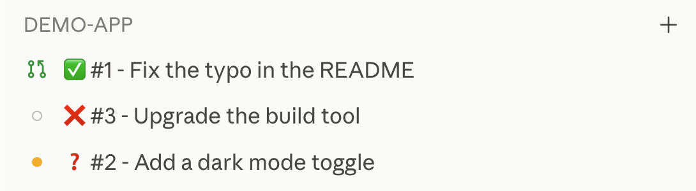

# Sectile user guide

Sectile brings tracker tickets, coding agents, local worktrees, and pull requests into one workflow. This guide takes you from your first browser sign-in to a pull request ready for human review. It assumes that your team already runs a Sectile server and that you can reach it from a workstation with your code repository and coding CLI.

## Contents

1. [Connect to the web interface](#connect-to-the-web-interface)
2. [Set up a personal Jira token](#set-up-a-personal-jira-token)
3. [Use an existing project](#use-an-existing-project)
4. [Add a new project](#add-a-new-project)
5. [Pair and set up your workstation](#pair-and-set-up-your-workstation)
6. [Configure the project in Desktop](#configure-the-project-in-desktop)
7. [Use a prompt in Claude Code](#use-a-prompt-in-claude-code)
8. [Run the full workflow autonomously](#run-the-full-workflow-autonomously)
9. [Follow work in Desktop](#follow-work-in-desktop)

## Connect to the web interface

1. Open the URL your team uses for Sectile. For local development, the [quick start](../README.md#quick-start) uses `http://localhost:8090`.
2. On **Sign in to Sectile** (*Se connecter à Sectile*), choose the identity provider if the deployment offers one. A deployment using local sign-in asks for your email address instead. Its optional sealing passphrase unlocks your own sealed tracker tokens; it is not a login password.
3. Select your project in the sidebar. The board and backlog show its tickets; the project picker can also show all projects together. Open a ticket to read its description, workflow stage, activity, and pull request link.

If your account or a project is missing, ask the Sectile administrator or project owner for access. The [root README](../README.md) describes how to start a local server for development.

## Set up a personal Jira token

A Jira project needs your own Jira access for actions attributed to you. Set it in the **Profile → Tracker credentials** (*Profil → Identifiants Trackers*) area of the web interface.

### Connect Jira

When your administrator configured the Jira connection, the **Jira** entry offers **Connect Jira** (*Connecter Jira*):

1. Select **Connect Jira**. Your browser goes to Atlassian's consent screen, which lists what Sectile asks to do.
2. Accept, and pick every Jira site your Sectile projects use. You land back on **Profile → Tracker credentials**, which shows the Jira account Atlassian confirmed and the sites covered.

Sectile renews the connection in the background: there is no token to create and no passphrase to unlock, and your queued writes and agent stage reports go out under your account while you are away. Connecting replaces an API token you had stored.

If you revoke Sectile from your Atlassian account, or leave it unused for about 90 days, the entry says the connection was lost and offers **Reconnect Jira** (*Reconnecter Jira*); your Jira writes are refused until you reconnect. A write on a project whose Jira site you did not pick is refused the same way: reconnect and pick that site. **Disconnect** (*Déconnecter*) forgets the connection in Sectile; to remove it on Atlassian's side too, remove Sectile from the connected apps of your Atlassian account at id.atlassian.com.

### Use an API token

Without the Jira connection configured, or after selecting **Use an API token instead** (*Utiliser un jeton d'API à la place*):

1. Select **Jira** and enter your Jira site URL, Atlassian account email, and API token. Create the token in your Atlassian account's API tokens section. The site and email belong to the same account as the token.
2. Select **Verify** (*Vérifier*), then **Save** (*Enregistrer*). The form enables saving after the site accepts the credentials.
3. Optionally select **Seal my tokens** (*Sceller mes jetons*) and set one master sealing passphrase for your personal tracker tokens. Keep it somewhere you can retrieve it. At a later sign-in, enter it on the sign-in screen or select **Unlock all tokens** (*Déverrouiller tous les jetons*) in the profile.

A sealed and locked personal token cannot authorize your task writes. A Jira connection is never sealed. Sectile reports the refusal instead of silently using another account. The same holds when you have no personal token at all: the error notification then offers to add it, and opens this area on the tracker concerned. A server credential, when configured by an administrator, is for unattended synchronization; it does not replace your personal credential for actions you cause. Never paste an API token or sealing passphrase into a ticket, coding prompt, or Desktop project setting. See [credential ownership](adrs/0029-server-tracker-credential-signs-unattended-work-only.md) for the full rule.

### Configure the Jira connection (administrators)

1. On developer.atlassian.com, create an OAuth 2.0 (3LO) integration. Under **Permissions**, add the Jira API scopes `read:jira-work`, `write:jira-work` and `read:jira-user`, and the Jira Software scopes `read:board-scope:jira-software`, `read:board-scope.admin:jira-software`, `write:board-scope:jira-software`, `read:sprint:jira-software`, `write:sprint:jira-software`, `delete:sprint:jira-software` and `read:project:jira`. Sectile also asks for `offline_access`, which needs no declaration.
2. Under **Authorization**, set the callback URL to `https://<your Sectile server>/auth/jira/callback`.
3. Under **Distribution**, enable sharing, so people other than the app's owner can authorise it. Your Atlassian organisation must also allow its members to authorise third-party apps.
4. In Sectile, open **Administration → Jira connection (Atlassian OAuth)** and save the client ID, the secret and the same callback URL, or set `SECTILE_JIRA_OAUTH_CLIENT_ID`, `SECTILE_JIRA_OAUTH_CLIENT_SECRET` and `SECTILE_JIRA_OAUTH_REDIRECT_URL` on the server. A configuration saved on the page wins over the environment. The secret is never shown again.

Clearing the configuration brings back the API token form; existing connections stay stored but can no longer renew.

## Use an existing project

1. Select the project from the sidebar's project picker. Use its board, backlog, search, or saved views to find a ticket.
2. Open the ticket to check its tracker link, description, stage, and any current pull request. A task's stage tells you which workflow step comes next.
3. For local execution, connect a workstation and map the project to a local repository as described below. A project visible in the browser does not by itself give the agent a folder to work in.

If the project uses Jira, its **Tracker** settings identify the Jira project key. Your personal Jira site, email, and token remain in your profile. The project can also list several Git repositories; each repository you change may need its own pull request.

## Add a new project

1. In the web project's picker, choose **New project…** (*Nouveau projet...*).
2. On **General** (*Général*), enter a project title and optional description. Set a default project only if that is how you want the picker to open.
3. On **Tracker**, choose the issue tracker. For Jira, enter its project key; for GitHub or GitLab, enter the repository or project identity. Choose local storage for a project without a remote tracker. Complete the Git remote URL and any other repository identities the project uses.
4. Review **Agentic workflow** and **Skills & SDD**, then select **Create project** (*Créer le projet*). Configure any required tracker credential in your profile and synchronize the project to import remote tickets.
5. In Desktop, add the server project and select its local repository folder. Server project metadata and local folder paths are separate settings.

Keep Git remote identities consistent with the repositories on your workstation.

## Pair and set up your workstation

Pairing lets your local agent act as you without putting a long-lived key in a prompt.

1. Install [Sectile Desktop](../desktop/README.md#install-a-release) on the workstation, open it, enter the server URL, and select **Sign in with your browser**. Sign in to Sectile in the browser that opens, or let it return at once if you are already signed in, then close the tab. Desktop starts its bundled agent. **Settings → Agent connection** shows whether the agent and server are connected and offers Start, Stop, and Restart controls.
2. Without a browser on that machine, pair with a code instead: in the web profile, open **Workstations & Agent** and select **Pair a workstation** (*Appairer une machine*), copy the temporary, single-use code, and paste it in the **Pairing code** field of Desktop's connection screen.
3. To run the agent without Desktop, use the binary on that workstation:

   ```sh
   sectile-agent pair --url https://sectile.example.com
   sectile-agent --url https://sectile.example.com --project '<project-id>' --repo /path/to/clone
   ```

   `pair` opens the browser to sign you in; `--no-browser` prints the address to open instead, in a browser on the same machine. On a remote or headless machine, pass a code from the web profile with `--code '<pairing-code>'`. Replace the example URL, project ID, and path with your own values. Pairing stores the workstation credential for later starts. The [root README](../README.md#connect-a-workstation) shows the local-server form of these commands.

   Pairing the same workstation again, from Desktop or `sectile-agent pair`, revokes its previous key and points the `sectile` MCP entries Sectile manages at the new one; restart an agent that was already running so it uses the new key. Your web session lasts up to 90 days and ends after 7 days without use.

4. Confirm the workstation appears in the web profile and that Desktop reports **Connected**. If the agent cannot start a task, check **Settings → Agent logs** and the project's local folder mapping.

Once the workstation is paired, Desktop starts the local agent with the saved key each time it opens, so you do not paste a code again after a restart. It asks you to pair again, under **Pair again**, with **Sign in with your browser** or a new pairing code, only when the saved key is missing, can no longer be read, or is refused by the server, and it says which.

## Configure the project in Desktop

1. Select **Add project** from Desktop's project sidebar, or use the project configuration view for one already shown. Choose the local Git checkout with **Choose folder…**.
2. Open the project's **General** category to inspect its Git remote, SDD framework, and default coding engine. In **Folders**, map local repositories and, when needed, a Macro or an Issue specifications folder (where macro skills and issue skills keep their specifications) or attached folders. These paths stay on your workstation. Every execution of the project is given these folders, ticket discussions and Claude or Codex conversations included. A folder can also be attached without leaving a conversation, a running ticket discussion or a running **Project prompt** console, also once moved to the native terminal, from its **Add folder…** action: Claude Code sees it at once in a discussion or a console, and from the next message in a conversation. Turn on **Any repository** to let the project's tickets change a repository it does not list: the agent uses the checkout the session names, or clones the repository into the **Clones folder** (by default next to the local repository), and remembers it on this workstation. With this option on and the specifications kept away from the code repository (dropped, or in an Issue specifications folder of their own), a ticket gets no worktree in the code repository until it needs one, so a change made only in another repository needs no pull request in the code repository. In a ticket's details, **Repository** › **Other repository…** pins it to a repository typed by hand.
3. In **Execution**, choose whether tasks use worktrees, how many executions can run, and the terminal behavior. Use workstation **Execution defaults** for settings shared by projects; project overrides can inherit those defaults.
4. Select **Save local configuration**. In **Settings → Deployment**, install the project's skills and initialize its chosen SDD framework when those tools are not yet present. In **AI engines**, choose or configure the CLI you intend to run. The CLI must also be installed and signed in on the workstation.

The [Desktop guide](../desktop/README.md#user-configuration-and-commands) covers the full set of controls. The browser owns shared project and tracker settings; Desktop owns this workstation's paths, engine commands, and execution preferences.

## Use the Desktop conversation view

Choose **Settings → General → AI consoles → Conversation** to open Claude
or Codex interactive ticket launches and project prompts in a chat view. The
provider CLI must already be installed and signed in. Replies stream, tools
appear as cards, and approvals or questions wait for your answer in those
cards. **Stop answer** keeps the session open; **Stop execution** ends it.
Codex provides its own models, efforts and sandbox modes, and installed skills
complete with `$`. See the [Desktop conversation guide](../desktop/README.md#experimental-conversations).

## Use a prompt in Claude Code

You can run a workflow skill in an existing Claude Code session rather than launching it from a ticket:

1. Configure Claude Code's Sectile MCP connection in Desktop under **Settings → Deployment → MCP configuration**. Choose the transport appropriate to your setup, select **Update provider configuration**, and restart Claude Code. If Claude Code's `sectile` entry uses a key this workstation does not use, for example one Sectile did not write or one left from an earlier pairing in a project's settings, this section flags it and offers **Repair**, which writes the current key and removes the outdated project entries. Desktop can also deploy the server's skills under **Settings → Deployment**. See [MCP connections](../desktop/README.md#mcp-connections).
2. Open Claude Code in the ticket's repository on the paired workstation. Open the ticket in the web interface and use **Copy** for the next workflow skill or **Copy** for `/pickup-issue`; on the board, the copy button of a full card copies the next workflow skill's prompt in one click. Paste the complete copied prompt into Claude Code. It includes the task's full ID and instructions to read Sectile MCP context and report the run.
3. Follow the conversation and task activity. Answer a clarification question if the skill asks one. For a single step, launch the next stage after Sectile records the prior stage. For the pickup prompt, the skill continues through the stages it can complete and stops before merge.

A free-form Claude Code prompt is useful for discussion or exploration, but it does not by itself record a Sectile stage transition. Use the copied workflow prompt or the task's configured skill action for tracked workflow work.

### What the session shows

When you run a workflow skill in the Claude desktop app, the skill keeps the session readable from the sidebar. As soon as it has identified the ticket, it renames the session `<ticket ID> - <ticket title>`, for example `#47 - Remove the parallelism setting`. A batch pickup uses the first ticket and the number of others, as in `#47 (+2) - Remove the parallelism setting`, and a macro skill uses the macro's ID and title. The ID and title then stay fixed; only a leading status emoji comes and goes. While the skill works, the title carries no emoji, since the app already shows that the session is running.

| Emoji | Meaning | When it appears |
| --- | --- | --- |
| ❓ | The skill waits for you. | Right before a question it cannot continue without, or when it stops with open questions. It disappears when the work resumes. |
| ✅ | The skill reached its goal. | When the run finishes as completed. |
| ❌ | The skill stopped on a failure or a blocker. | When the run finishes as failed. |

The emoji changes at the same moment Sectile records the run's state, so the title and the board agree.



Right after the rename, the conversation shows a `Ticket:` line linking the ticket in its tracker (`Macro:` for a macro), unless it has no external link. Once the skill creates or finds a pull request or merge request, a `PR:` line links it. A GitHub pull request is also bound to the session, so it appears in the app's pull request bar; on GitLab, the `PR:` line is the only link.

The skill also files the session under a sidebar group named after the Sectile project, reusing the group when it exists. It marks chapters: one per stage under a pickup, such as `Specify #47`, and one when a single skill starts in a session that already holds earlier work. When implement, adjust or a pickup changed code, it opens the session's diff pane, or names the worktree when the pane does not cover it. On ✅ the reply ends with the next step, ready to copy, using the command name the skills run under: `/handoff-issue <task ID>`, for example, or `/sectile:handoff-issue <task ID>` with the [Claude plugin](../README.md#install-sectile-in-your-coding-cli). On ❓ or ❌ it says instead what you have to answer or fix. On ❓, ✅ or ❌ the skill sends one desktop notification, and none for routine progress.


A stage skill nested in a pickup leaves all of this to the pickup, so the session keeps one title and one set of links. When Sectile Desktop launches the run, the skill skips the links, the next step and the notification, since Desktop shows them itself; see the [Desktop guide](../desktop/README.md#skill-result-indicator) for Desktop's own indicators. With another coding CLI, the same skills use only what that host exposes. A missing capability, or an action the app refuses or leaves unapproved, such as a rename, is skipped and the run continues. A host that cannot rename the session still shows the run's state on the board.

## Run the full workflow autonomously

For a configured project with an available workstation agent and coding engine:

1. Open the ticket on the board. Check that its description is sufficient, the repository mapping is correct, and your personal tracker credential is available for attributed writes.
2. On the task card choose **Full chain** (*Chaîne complète*). Sectile starts the pickup workflow from the ticket's current stage in autonomous mode.
3. Follow the activity in the browser or the execution in Desktop. The chain clarifies, specifies, implements, tests, and adjusts the pull request as its stage contracts allow. It may stop for an essential owner decision or a failed check; resolve that cause and resume from the recorded stage.
4. Open the linked pull request when the task reaches review. A person reviews and merges it; handoff follows the merge.

**Advance autonomously** (*Avancer en autonome*) on a card runs only the next step. Choose **Full chain** when you want the entire pickup sequence. The available chain starts at the ticket's current stage, so a previously specified ticket does not repeat clarification. Once the ticket has reached the stage where the project's full chain stops, the card no longer offers **Full chain**: a full card shows a robot button in its place, which runs the next step autonomously, and a condensed card's menu keeps **Advance autonomously**.

## Follow work in Desktop

Desktop lists your configured projects and local executions. Use **Open tasks** on a project or **Tasks list** in the command palette to find an existing ticket; selecting it does not launch anything. Launch a task skill or full pickup from its available actions. **Quick add task** creates a tracker task first and offers a separate launch action.

Select an execution to see its console, status, and recorded skill result. **Changes** shows the current local worktree diff, and **Rendered** shows a selected Markdown file as a formatted document, with the images it references from the repository (PNG, JPEG, GIF, WebP, SVG); an image that cannot be shown keeps its alt text and says why on hover; **Console** returns to output. A project queue shows running and waiting executions. The toolbar can stop an execution or open **Launch**, which starts a new execution of the task with a chosen skill, instructions, execution mode and AI engine, and **Next: Clarify**, **Next: Specify**, **Next: Implement**, or **Next: Adjust** advances one verified step. **Awaiting human merge** means the pull request is ready for its owner to review. Closing Desktop leaves the local agent and its running work active; reopen Desktop to reconnect.

See the [Desktop guide](../desktop/README.md#use) for installation, settings, console behavior, and recovery details.

Codex conversations use **Settings → Codex settings → Approval reviewer** to
choose **Ask me** or **Approve on my behalf**, applying from the next message
with the sandbox still active. Claude’s initial **Conversation permission mode**
is configured in **Settings → Claude settings**.

Desktop **General** settings combine user profile information and appearance.
Use **Search settings** to find fields across the loaded settings categories.
The settings content fills the available width and adapts to window resizing.

### See a project's board

Use **Open board** on a project, or **Project board** in the command palette, to see the project's tasks in six workflow columns: **New**, **Clarified**, **Specified**, **Implemented**, **Reviewed** and **Finished**, finished tasks included. A task sits in the column the web board shows it in: its workflow label first, then the stage the project maps its tracker column to, then its status. The board replaces the tickets list while it is open; **Close board** or Escape returns to the previous view. The search field narrows the board to the tasks whose title or key matches.

- **Finished column.** It starts collapsed into a narrow strip showing its count. Click the strip to expand it and **Hide finished** to collapse it again.
- **Card display.** **Condensed** shows the key, the title, the latest execution's state and the actions menu on one line. **Full** adds the macro, the priority, the labels, the pull request and the assignee.
- Both choices are remembered on this workstation for every project, and do not change the web board.
- When the project enables macro colours, a card whose task has a macro carries that macro's colour on its left edge, the same colour as on the web board.
- A card's **…** menu offers the same actions as a row of the tickets list. Selecting its title opens the task in Sectile and launches nothing.
- **Move a task between stages.** Drag a card onto another column, or onto the collapsed Finished strip. The task takes that column's workflow label and status, and its tracker status follows the project's stage mapping, exactly as a move on the web board does. Any stage is accepted, backwards included; no skill is launched and no stage report is recorded. If the server refuses the move, the card stays where it was and the board shows why. Moving needs a local agent recent enough to support it; with an older agent the cards cannot be dragged.

### Provider model lists

Configure the models offered at launch under **Settings → AI engines → Models offered**, grouped by Antigravity, Claude and Codex. Each provider has its own **Models offered** field and **Save models** button. Reset restores the shipped list; saving an empty custom list offers no models. Execution defaults save separately and preserve these choices. Upgrade the local agent together with Desktop.
