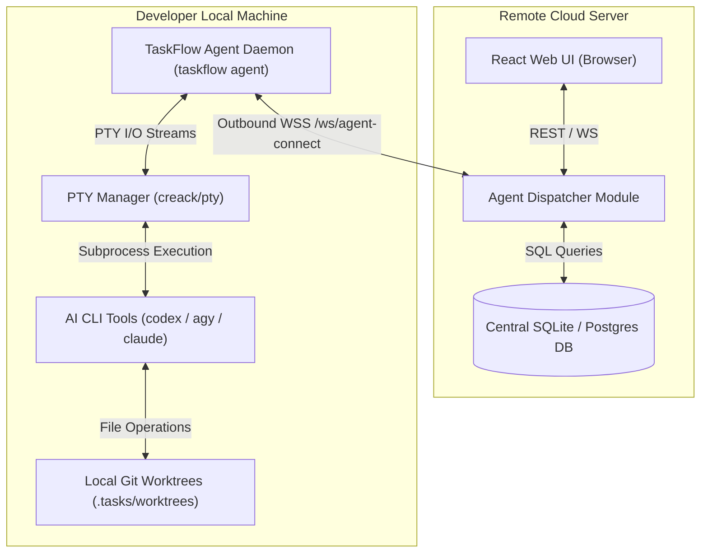

## Context

TaskFlow's core engine relies on executing AI coding skills (`clarify-issue`, `specify-issue`, `code-issue`, etc.) and PTY terminal sessions within isolated local Git worktrees (`.tasks/worktrees/<taskKey>`). To host TaskFlow centrally on a remote website while keeping code files, Git worktrees, and LLM credentials local, we must decouple the remote Web UI/Database from local task execution via an outbound WebSocket relay.

## Goals / Non-Goals

**Goals:**
- Implement an outbound WebSocket connection protocol between a local `taskflow agent` daemon and a remote TaskFlow server.
- Route Web UI workflow actions (e.g. `clarify`, `specify`, `code`, interactive shell) from the remote server to the user's connected local agent.
- Enforce strict identity matching (`web_session.user_id == agent_session.user_id`) and project workspace mapping.
- Stream live PTY terminal I/O bi-directionally between remote Xterm.js and the local agent's `creack/pty` manager.
- Cap active local agent connections to 1 per user per project mapping.

**Non-Goals:**
- Inbound HTTP connection from remote server to local machine (requires public IP / port forwarding).
- Running LLM execution or storing LLM API keys on the remote cloud server.
- Multi-tenant billing or complex RBAC beyond single-user identity matching.

## Architectural Decisions

1. **Outbound WebSocket Agent Transport (`wss://`)**:
   - The local daemon connects outward to `/ws/agent-connect` on the remote server using an API token generated in the Web UI.
   - Outbound WebSocket prevents NAT / firewall routing complications.

2. **Message Envelope & Payload RPC**:
   - Messages are encoded as JSON objects containing:
     - `msgId` (UUID string)
     - `type` (`dispatch_step` | `pty_input` | `pty_resize` | `step_status` | `pty_output` | `heartbeat`)
     - `taskId` (Task Key string)
     - `userId` (Owner User ID)
     - `payload` (Command arguments or raw ANSI data)

3. **User Identity & Session Guard**:
   - Upon receiving a trigger request from the Web UI, `AgentDispatcher` validates `web_session.user_id == agent_session.user_id`.
   - If the user has no connected agent, the server returns an HTTP 428 Precondition Required error ("Local agent disconnected").

4. **1:1 Agent Concurrency & Rebind Policy**:
   - Hard cap of 1 active local agent connection per user/project mapping.
   - If a user launches `taskflow agent` on a second machine for the same project, the server terminates the previous WebSocket session with code `4001 Session Rebound` and registers the new daemon.

## Risks & Trade-offs

- **Risk**: Intermittent network disconnection between local agent and remote server.
  - *Mitigation*: Local agent implements exponential backoff reconnection logic; PTY history buffer in local agent retains 64KB output for seamless replay upon reconnect.
- **Risk**: Command execution lag over WebSocket network link.
  - *Mitigation*: Binary/compressed text frame transport over WebSocket for ANSI terminal streams.
