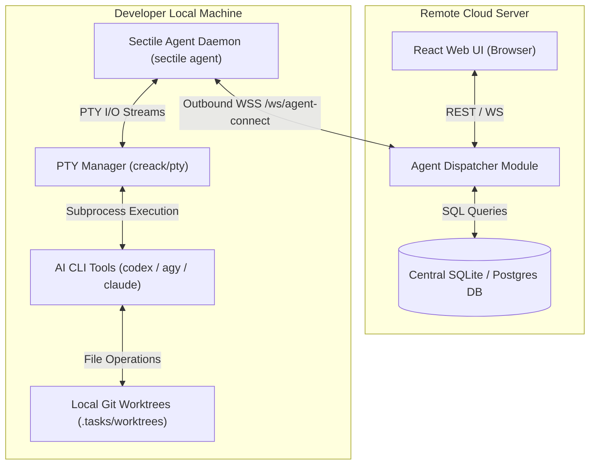

## Context

Sectile's core engine relies on executing AI coding skills (`clarify-issue`, `specify-issue`, `code-issue`, etc.) and PTY terminal sessions within isolated local Git worktrees (`.tasks/worktrees/<taskKey>`). To host Sectile centrally on a remote website while keeping code files, Git worktrees, and LLM credentials local, we must decouple the remote Web UI/Database from local task execution via an outbound WebSocket relay.

## Goals / Non-Goals

**Goals:**
- Implement an outbound WebSocket connection protocol between a local `sectile agent` daemon and a remote Sectile server.
- Route Web UI workflow actions (e.g. `clarify`, `specify`, `code`, interactive shell) from the remote server to the user's connected local agent.
- Enforce strict identity matching (`web_session.user_id == agent_session.user_id`) and project workspace mapping.
- Stream live PTY terminal I/O bi-directionally between remote Xterm.js and the local agent's `creack/pty` manager.
- Cap active local agent connections to 1 per user per project mapping.

**Non-Goals:**
- Inbound HTTP connection from remote server to local machine (requires public IP / port forwarding).
- Running LLM execution or storing LLM API keys on the remote cloud server.
- Multi-tenant billing or complex RBAC beyond single-user identity matching.

## Architectural Decisions

1. **Outbound WebSocket Agent Transport (`wss://`)**:
   - The local daemon connects outward to `/ws/agent-connect` on the remote server using an API token generated in the Web UI.
   - Outbound WebSocket prevents NAT / firewall routing complications.

2. **Message Envelope & Payload RPC**:
   - Messages are encoded as JSON objects containing:
     - `msgId` (UUID string)
     - `type` (`dispatch_step` | `pty_input` | `pty_resize` | `step_status` | `pty_output` | `heartbeat`)
     - `taskId` (Task Key string)
     - `userId` (Owner User ID)
     - `payload` (Command arguments or raw ANSI data)

3. **User Identity & Session Guard**:
   - Upon receiving a trigger request from the Web UI, `AgentDispatcher` validates `web_session.user_id == agent_session.user_id`.
   - If the user has no connected agent, the server returns an HTTP 428 Precondition Required error ("Local agent disconnected").

4. **1:1 Agent Concurrency & Rebind Policy**:
   - Hard cap of 1 active local agent connection per user/project mapping.
   - If a user launches `sectile agent` on a second machine for the same project, the server terminates the previous WebSocket session with code `4001 Session Rebound` and registers the new daemon.

## Risks & Trade-offs

- **Risk**: Intermittent network disconnection between local agent and remote server.
  - *Mitigation*: Local agent implements exponential backoff reconnection logic; PTY history buffer in local agent retains 64KB output for seamless replay upon reconnect.
- **Risk**: Command execution lag over WebSocket network link.
  - *Mitigation*: Binary/compressed text frame transport over WebSocket for ANSI terminal streams.

## MCP and configuration implementation (September 2026)

The follow-up implements architecture sections 7.2–7.5. The official MCP Go SDK
owns protocol negotiation, typed tool schemas and Streamable HTTP at `/mcp`.
`sectile mcp` bridges stdio to that endpoint through the loopback agent gateway
or directly to the configured server; neither agent command opens a database.
The existing database services remain authoritative for stage validation, managed
run guards, comments, and queued tracker synchronization. Tool results explicitly
report tracker synchronization as queued, rather than claiming immediate completion.

`GET /api/v1/agent/config?projectId=...` (or `taskKey=...`) returns schema version 1,
project and tracker identity, specification framework, workflow mappings, effective
AI/terminal settings and effective skill content. It excludes tracker credentials
and server filesystem paths. Concrete project agents synchronize on connection;
wildcard agents resolve the actual task project on dispatch. Each dispatch refreshes
configuration before execution. Unknown contract versions fail before launching.

Workstation repository mappings and overrides live in `.taskflow/agent.json`.
The agent prepares Git worktrees locally, verifies existing branches and preserves
locally modified skills through a hash manifest. Server paths are never interpreted
as local paths. The CLI terminal flag takes precedence over local overrides, which
take precedence over remote configuration. No offline stale-config execution is
attempted when the authoritative API is unavailable.

Both machine endpoints share the agent bearer identity policy. Setting
`SECTILE_SERVER_TOKEN` pins a credential; without it, legacy single-user mode
accepts a nonempty token. This is not multi-user authentication. The gateway binds
only to loopback, rejects browser Origin and unexpected Host headers, and attaches
the daemon credential itself. Existing public REST/UI authentication is unchanged.

## Native-client execution scope

The agreed implementation uses the web UI and native Codex/Claude clients. The
experimental Electron chat companion is superseded. An explicit project agent
connection scaffolds skills and registers MCP in the selected local repository,
allowing a user to invoke pickup directly. Web dispatch prepares a task worktree
and launches the same skill in a native terminal. Conversations and approvals
remain entirely in the coding client; task reads and updates use MCP.
