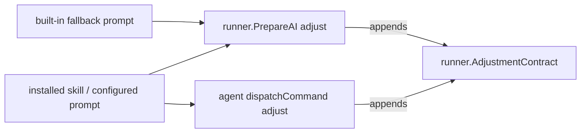

# Plan #558 - The adjustment contract carries guardrails only

## Stack

- Go: `internal/runner` (managed prompt), `internal/agent` (native launch).
- Docs: `docs/adrs`, `CHANGELOG.md`.

## Architecture



Both call sites append the same constant, so the change is the constant's
text. No call site moves.

## Target files

| File | Change |
| --- | --- |
| `internal/runner/adjustment.go` | Rewrite `AdjustmentContract` to FR1 only; comment points to ADR 0038. |
| `internal/runner/adjustment_test.go` | Managed prompt tests: configured prompt (AC2), fallback (AC3). |
| `internal/agent/agent_config_test.go` | Native launch: guardrails present, prescriptions absent (AC1). |
| `docs/adrs/0038-the-adjustment-contract-carries-guardrails-only.md` | New ADR. |
| `docs/adrs/0004-adjustment-and-earlier-pr-ownership.md` | Amendment note. |
| `CHANGELOG.md` | `Changed` line. |

## Contract text

```
Mandatory adjustment contract: verify the existing matching task-branch PR
before changes; it must be open, or already merged by the human. Never push
onto a merged PR: review its final state and report it. Never create or
replace a PR; missing PR recovery belongs to the configured earlier creation
stage. Retrieve available feedback and record a disposition for each;
retrieval failure blocks completion, and no human feedback is required.
Preserve work on failure. Never merge, approve, close the task or remove its
worktree.
```

## Rejected alternatives

- Dropping the contract entirely: the guardrails protect the PR ownership of
  ADR 0004 whatever skill runs.
- A per-project switch for the prescriptions: adds a setting for what the
  skill itself already expresses.
